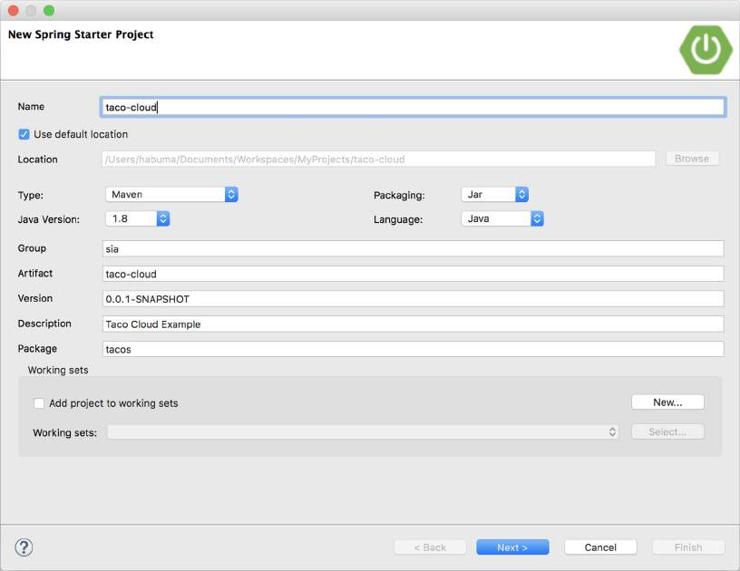

# 1.2.1 使用 Spring Tool Suite 初始化 Spring 项目

要开始使用 Spring Tool Suite 中的新建 Spring 项目，请转到 “文件” 菜单并选择 “新建”，然后选择 “Spring Starter Project”。图 1.2 显示了要查找的菜单结构。

一旦选择了 Spring Starter Project，就会出现创建新的项目向导对话框（图1.3）。向导的第一页要求提供一些常规项目信息，例如项目名称、描述和其他基本信息。如果您熟悉Maven pom.xml 文件的内容，则可以将大多数字段识别为以 Maven 构建规范结尾的项目。对于 Taco Cloud 应用程序，填写如图 1.3 所示的对话框，然后单击 “下一步”。

向导的下一页使您可以选择要添加到项目中的依赖项（请参见图 1.4）。注意，在对话框顶部附近，您可以选择要作为项目基础的 Spring Boot 版本。默认为最新可用版本。通常，最好保持原样，除非您需要定位其他版本。

至于依赖项本身，您可以展开各个部分并手动查找所需的依赖项，或者在 “可用” 列表顶部的搜索框中搜索它们。对于 Taco Cloud 应用程序，选择图 1.4 中所示的依赖项。

此时，可以单击完成以生成项目并将其添加到工作区。但是，如果感到有点危险，请再次单击 “下一步”，以查看新的 starter 项目向导的最后一页，如图 1.5 所示。

默认情况下，新项目向导在 [http://start.spring.io](http://start.spring.io) 上调用 Spring Initializr 以生成项目。通常，不需要覆盖此默认值，这就是为什么可以在向导第二页上单击 “完成” 的原因。但是，如果由于某种原因要托管自己的 Initializr 克隆版本（也许是自己计算机上的本地副本，或者是在公司防火墙内运行的自定义克隆版本），那么将需要更改 Base Url 字段以指向 Initializr 实例，然后单击完成。

单击完成后，将从 Initializr 下载该项目并将其加载到工作区中。稍等片刻，使其加载和构建，然后就可以开始开发应用程序功能了。但是首先，让我们看一下 Initializr 所带来的好处。

