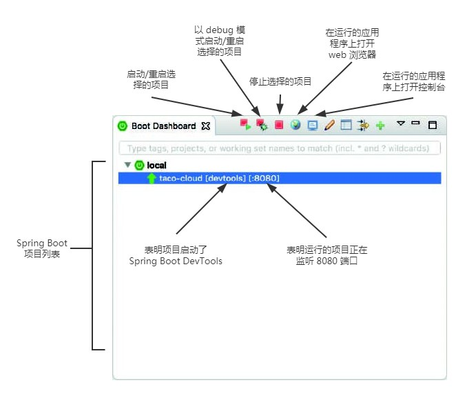

# 1.3.4 构建并运行应用程序

正如有多种方法可以初始化 Spring 应用程序一样，也有多种方法可以运行 Spring 应用程序。如果愿意，可以翻到附录部分，阅读一些更常见的运行 Spring 引导应用程序的方法。

因为选择使用 Spring Tool Suite 来初始化和处理项目，所以有一个称为 Spring Boot Dashboard 的便利功能可以帮助你在 IDE 中运行应用程序。Spring Boot Dashboard 显示为一个选项卡，通常位于 IDE 窗口的左下方。图 1.7 显示了 Spring Boot Dashboard 的注释截图。

虽然图 1.7 包含了一些最有用的细节，但我不想花太多时间来检查 Spring Boot Dashboard 所做的一切。现在需要知道的重要事情是如何使用它来运行 Taco Cloud 应用程序。确保 taco-cloud 应用程序在项目列表中突出显示（这是图 1.7 中显示的惟一应用程序），然后单击 start 按钮（最左边的按钮，其中有绿色三角形和红色正方形），应用程序应该会立即启动。

当应用程序启动时，将在控制台中看到一些 Spring ASCII 图飞过，然后看到一些日志条目描述应用程序启动时的步骤。在停止日志记录之前，将看到一个日志条目，其中说 Tomcat 在 port\(s\): 8080 \(http\) 上启动，这意味着已经准备好将 web 浏览器指向主页，以查看结果。

等一下，Tomcat 启动？何时将应用程序部署到 Tomcat？

Spring Boot 应用程序倾向于裹挟所有需要的东西，而不需要部署到某个应用服务器。你从未将应用程序部署到 Tomcat… 其实 Tomcat 是应用程序的一部分！\(将在 1.3.6 小节中详细描述 Tomcat 如何成为应用程序的一部分的。\)

现在应用程序已经启动，将 web 浏览器指向 [http://localhost:8080](http://localhost:8080)（或单击 Spring Boot Dashboard 中地球仪样子的按钮\)，应该会看到类似图 1.8 所示的内容。如果你设计了自己的图标，那么结果可能不同，但是它与在图 1.8 中看到的应该相差不大。

它可能没什么好看的。但这并不是一本关于平面设计的书。主页的简陋外观现在已经足够了。它为你了解 Spring 提供了一个坚实的开端。

到目前为止，忽略了 DevTools。在初始化项目时将其作为依赖项进行选择。它作为一个依赖项出现在生成的 pom.xml 文件中。Spring Boot Dashboard 甚至显示项目已经启用了 DevTools。但是什么是 DevTools，它能为您做什么？让我们快速浏览一下 DevTools 的几个最有用的特性。

