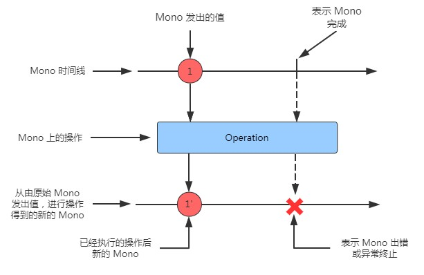

# 10.2.1 图解响应式流

响应式流通常使用弹珠图（Marble Diagram）进行绘制。弹珠图最简单的形式就是，在最上面画出数据流经 Flux 或是 Mono 的时间线，在中间画出操作，在最下面画出 Flux 或是 Mono 结果的时间线。图 10.1 展示了 Flux 的弹珠图模板。正如你所看到的，当数据流通过原始的 Flux 后，它通过一些操作进行处理，通过数据流处理后产生一个新的 Flux。

图 10.2 展示了一个类似的弹珠图，但是是对于 Mono 而言的。正如你所看到的，关键的区别在于 Mono 会有零个或一个数据项，或一个错误。

在 10.3 节中，我们将探讨 Flux 和 Mono 支持的许多操作，将使用弹珠图来想象它们是如何工作的。

