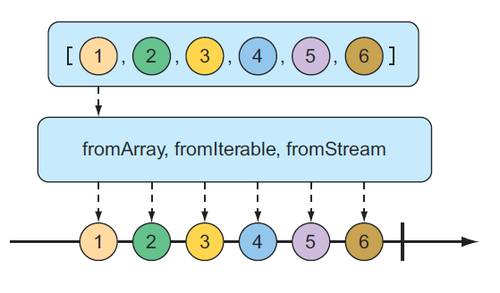
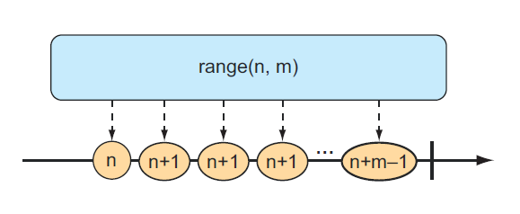
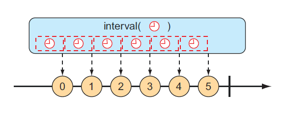

# 10.3.1 创建响应式类型

当时长使用 Spring 中的响应式类型时，会从 respository 或是 service 中得到 Flux 或是 Mono，因此需要你自己创建一个。但是有时候你需要创建一个新的响应式发布者。

Reactor 为创建 Flux 和 Mono 提供了多个操作。在本节中，我们将介绍一些最有用的创建操作。

**从对象进行创建**

如果想从 Flux 或是 Mono 创建一个或多个对象，可以 Flux 或 Mono 中的静态方法 just\(\) 去创建一个响应式类型，其中的数据由这些对象驱动。例如，下面这个测试方法就是使用 5 个 String 对象来创建一个 Flux：

```java
@Test
public void createAFlux_just() {
    Flux<String> fruitFlux = Flux
        .just("Apple", "Orange", "Grape", "Banana", "Strawberry");
}
```

这样就创建了一个 Flux，但它没有订阅者。要是没有订阅者，数据不会流动。以花园软管的思路进行类比，你已经把软管接到出水口了，另一端就是从自来水公司流出的水。但是水不会流动，除非你打开水龙头。对响应式类型的订阅就是打开数据流的方式。

要添加一个订阅者，可以调用 Flux 中的 subscribe\(\) 方法：

```java
fruitFlux.subscribe(
    f -> System.out.println("Here's some fruit: " + f);
);
```

subscribe\(\) 中的 lambda 表达式实际上是 java.util.Consumer，用于创建响应式流的 Subscriber。由于调用了 subscribe\(\) 方法，数据开始流动了。在这个例子中，不存在中间操作，因此数据直接从 Flux 流到了 Subscriber。

为了在运行过程中观察响应式类型，一个好方法就是将 Flux 或 Mono 打印到控制台里面。但是，测试 Flux 或 Mono 更好的方式是使用 Reactor 中的 StepVerifier。给定一个 Flux 或 Mono，StepVerifier 订阅这个响应式类型，然后对流中流动的数据应用断言，最后验证流以预期方式完成。

例如，为了验证规定的数据流经 fruitFlux，可以写一个测试，如下所示：

```java
StepVerifier.create(fruitFlux)
    .expectNext("Apple")
    .expectNext("Orange")
    .expectNext("Grape")
    .expectNext("Banana")
    .expectNext("Strawberry")
    .verifyComplete();
```

这个例子中，StepVerifier 订阅了 Flux，然后对每一个匹配到的期望的水果名字做断言。最后，它验证了 Strawberry 是由 Flux 生成的，对 Flux 的验证完毕。

在本章余下的示例中，将使用 StepVerifier 编写测试用例以验证某些行为，并帮助你了解某些操作是如何工作的，从而了解一些 Reactor 最有用的操作。

**从集合创建**

Flux 也可从任何的集合创建，如 Iterable 或是 Java Stream。图 10.3 使用弹珠图绘制了这是如何运行的：



为了从数组创建一个 Flux，调用静态方法 fromArray\(\)，然后将数组作为数据源传入：

```java
@Test
public void createAFlux_fromArray() {
    String[] fruits = new String[] {
        "Apple", "Orange", "Grape", "Banana", "Strawberry" };
    
    Flux<String> fruitFlux = Flux.fromArray(fruits);
    StepVerifier.create(fruitFlux)
        .expectNext("Apple")
        .expectNext("Orange")
        .expectNext("Grape")
        .expectNext("Banana")
        .expectNext("Strawberry")
        .verifyComplete();
}
```

因为当你从对象列表中创建 Flux 的时候，源数组包含了你使用到的相同的水果名称，所以被 Flux 所命中的数据有相同的值。这样一来，你就在验证这个 Flux 之前使用相同的 StepVerifier。

如果你需要从 java.util.List、java.util.Set 或任何实现了 java.lang.Iterable 接口的类创建 Flux，你可以将它传入静态方法 fromIterable\(\) 中：

```java
@Test
public void createAFlux_fromIterable() {
    List<String> fruitList = new ArrayList<>();
    fruitList.add("Apple");
    fruitList.add("Orange");
    fruitList.add("Grape");
    fruitList.add("Banana");
    fruitList.add("Strawberry");
    Flux<String> fruitFlux = Flux.fromIterable(fruitList);
    // ... verify steps
}
```

或是，如果你突然想要把你用得顺手的 Java Stream 作为 Flux 的源，你将会用到 fromStream\(\) 方法：

```java
@Test
public void createAFlux_fromStream() {
    Stream<String> fruitStream =
        Stream.of("Apple", "Orange", "Grape", "Banana", "Strawberry");
    Flux<String> fruitFlux = Flux.fromStream(fruitStream);
    // ... verify steps
}
```

这里还是一样地使用 StepVerifier 去验证需要发布到 Flux 的数据。

**生成 Flux 数据**

有时你没有任何数据可供使用，只需要使用 Flux 作为计数器，发出一个随每个新值递增的数字。要创建计数器 Flux，可以使用静态 range\(\) 方法。图 10.4 展示了 range\(\) 是如何工作的。



下面的测试方法展示了如何创建一个范围的 Flux：

```java
@Test
public void createAFlux_range() {
    Flux<Integer> intervalFlux = Flux.range(1, 5);
    StepVerifier.create(intervalFlux)
        .expectNext(1)
        .expectNext(2)
        .expectNext(3)
        .expectNext(4)
        .expectNext(5)
        .verifyComplete();
}
```

在本例中，创建的范围 Flux 的起始值为 1，结束值为 5。StepVerifier 证明它将发布五个项目，即从 1 到 5 的整数。

另一个类似 range\(\) 的 Flux 创建方法是 interval\(\)。与 range\(\) 方法一样，interval\(\) 创建一个发出递增值的 Flux。但是 interval\(\) 的特殊之处在于，你不必给它一个起始值和结束值，而是指定一个持续时间或一个值的发出频率。图 10.5 展示了 interval\(\) 创建方法的弹珠图。



例如，可以使用静态的 interval\(\) 方法来创建每秒发送一个值的 Flux，如下所示：

```java
@Test
public void createAFlux_interval() {
    Flux<Long> intervalFlux = Flux.interval(Duration.ofSeconds(1)).take(5);
    StepVerifier.create(intervalFlux)
        .expectNext(0L)
        .expectNext(1L)
        .expectNext(2L)
        .expectNext(3L)
        .expectNext(4L)
        .verifyComplete();
}
```

请注意，间隔 Flux 发出的值以 0 开始，并在每个连续项上递增。另外，由于 interval\(\) 没有给定最大值，因此它可能永远运行。因此，还可以使用 take\(\) 操作将结果限制为前 5 个条目。我们将在下一节中详细讨论 take\(\) 操作。

