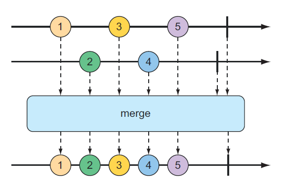
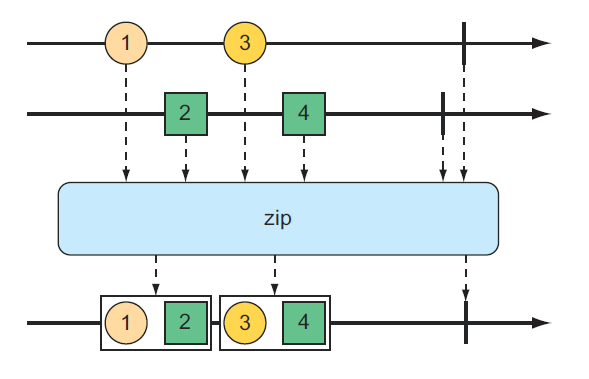
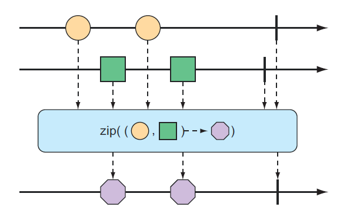
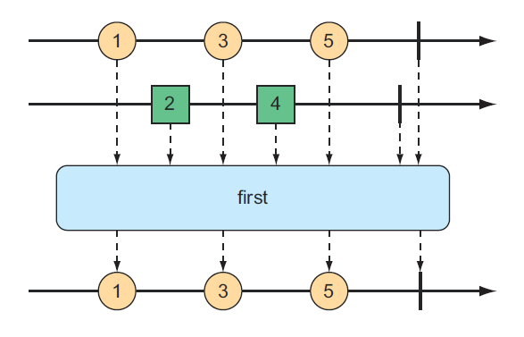

# 10.3.2 响应式类型结合

你可能发现你需要将两种响应式类型以某种方式合并到一起。或者，在其他情况下，你可能需要将 Flux 分解成多个响应式类型。在本节中，我们将研究 Reactor 中 Flux 和 Mono 的结合和分解操作。

**合并响应式类型**

假设你有两个 Flux 流，并需要建立一个汇聚结果的 Flux，它会因为能够得到上流的 Flux 流，所以能够产生数据。为了将一个 Flux 与另一个合并，可以使用 mergeWith\(\) 操作，如在图 10.6 展示的弹珠图一样：



例如，假设第一个 Flux 其值是电视和电影人物的名字，第二个 Flux 其值是食品的名称。下面的测试方法将展示如何使用 mergeWith\(\) 方法合并两个 Flux 对象：

```java
@Test
public void mergeFluxes() {
    Flux<String> characterFlux = Flux
        .just("Garfield", "Kojak", "Barbossa")
        .delayElements(Duration.ofMillis(500));

    Flux<String> foodFlux = Flux
        .just("Lasagna", "Lollipops", "Apples")
        .delaySubscription(Duration.ofMillis(250))
        .delayElements(Duration.ofMillis(500));

    Flux<String> mergedFlux = characterFlux.mergeWith(foodFlux);

    StepVerifier.create(mergedFlux)
        .expectNext("Garfield")
        .expectNext("Lasagna")
        .expectNext("Kojak")
        .expectNext("Lollipops")
        .expectNext("Barbossa")
        .expectNext("Apples")
        .verifyComplete();
}
```

通常情况下，Flux 会尽可能快的快地发送数据。因此，需要在创建 Flux 的时候使用 delayElements\(\) 操作，用来将数据发送速度减慢 —— 每 0.5s 发送一个数据。此外，你将 delaySubscription\(\) 操作应用于 foodFlux，使得它在延迟 250ms 后才会发送数据，因此 foodFlux 将会在 characterFlux 之后执行。

合并这两个 Flux 对象后，新的合并后的 Flux 被创建。当 StepVerifier 订阅合并后的 Flux 时，它会依次订阅两个 Flux 源。

合并后的 Flux 发出的数据的顺序，与源发出的数据的时间顺序一致。由于两个 Flux 都被设置为固定频率发送数据，因此值会通过合并后的 Flux 交替出现 —— character...food...character...food 一直这样下去。如何其中任何一个 Flux 的发送时间被修改了的话，你可能会看到 2 个 charater 跟在 1 个 food 后面或是 2 个 food 跟在 1 个 character 后面的情况。

因为 mergeWith\(\) 不能保证源之间的完美交替，所以可能需要考虑使用 zip\(\) 操作。当两个 Flux 对象压缩在一起时，会产生一个新的 Flux，该 Flux 生成一个元组，其中元组包含来自每个源 Flux 的一个项。图 10.7 说明了如何将两个 Flux 对象压缩在一起。



为了看看 zip\(\) 操作的执行情况，参考一下下面的测试方法，它把 character Flux 和 food Flux 压缩在了一起：

```java
@Test
public void zipFluxes() {
    Flux<String> characterFlux = Flux.just("Garfield", "Kojak", "Barbossa");
    Flux<String> foodFlux = Flux.just("Lasagna", "Lollipops", "Apples");

    Flux<Tuple2<String, String>> zippedFlux = Flux.zip(characterFlux, foodFlux);

    StepVerifier.create(zippedFlux)
        .expectNextMatches(p ->
            p.getT1().equals("Garfield") &&
            p.getT2().equals("Lasagna"))
        .expectNextMatches(p ->
            p.getT1().equals("Kojak") &&
            p.getT2().equals("Lollipops"))
        .expectNextMatches(p ->
            p.getT1().equals("Barbossa") &&
            p.getT2().equals("Apples"))
        .verifyComplete();
}
```

注意，与 mergeWith\(\) 不同的是，zip\(\) 操作是一个静态的创建操作，通过它创建的 Flux 使 character 和 food 完美对齐。从压缩后的 Flux 发送出来的每个项目都是 Tuple2（包含两个对象的容器），其中包含每一个源 Flux 的数据。

如果你不想使用 Tuple2，而是想用一些使用其他类型，你可以提供给 zip\(\) 你想产生任何对象的 Function 接口。



例如，以下的试验方法说明了如何压缩的 character Flux 和 food Flux，使得它产生 String 类型的的 Flux 对象：

```java
@Test
public void zipFluxesToObject() {
    Flux<String> characterFlux = Flux.just("Garfield", "Kojak", "Barbossa");
    Flux<String> foodFlux = Flux.just("Lasagna", "Lollipops", "Apples");

    Flux<String> zippedFlux = Flux.zip(characterFlux, foodFlux,
                                   (c, f) -> c + " eats " + f);

    StepVerifier.create(zippedFlux)
        .expectNext("Garfield eats Lasagna")
        .expectNext("Kojak eats Lollipops")
        .expectNext("Barbossa eats Apples")
        .verifyComplete();
}
```

给 zip\(\) 的 Function 接口（这里给出一个 lambda 表达式）简单地把两个值连接成一句话，由压缩后的 Flux 进行数据发送。

**选择第一个响应式类型进行发布**

假设你有两个 Flux 对象，你只是想创建一个新的发送从第一个 Flux 产生值的 Flux，而不是将两个 Flux 合并在一起。如图 10.9 所示，first\(\) 操作选择两个 Flux 对象的第一个对象然后输出它的值。



下面的测试方法创建一个 fast Flux 和 slow Flux（这里的 “slow” 的意思是它在订阅之后 100ms 才发布数据）。通过使用 first\(\)，它创建了一个新的 Flux，将只会发布从第一个源 Flux 发布的数据：

\(译者注：在 reactor 3.4 版本中，first\(\) 方法已被废弃，并将在 3.5 版本中被移除，替代方法是 firstWithSignal\(\)，选择第一个发出 Signal 的 Flux 对象\)

```java
@Test
public void firstFlux() {
    Flux<String> slowFlux = Flux.just("tortoise", "snail", "sloth")
        .delaySubscription(Duration.ofMillis(100));
    Flux<String> fastFlux = Flux.just("hare", "cheetah", "squirrel");

    // reactor 3.5: Flux<String> firstFlux = Flux.firstWithSignal(slowFlux, fastFlux);
    Flux<String> firstFlux = Flux.first(slowFlux, fastFlux);

    StepVerifier.create(firstFlux)
        .expectNext("hare")
        .expectNext("cheetah")
        .expectNext("squirrel")
        .verifyComplete();
}
```

在这种情况下，因为在 fast Flux 已经开始发布后 100ms，slow Flux 才开始发布数据，这样导致新创建的 Flux 将完全忽略 slow Flux，而只发布 fast flux 中的数据。

