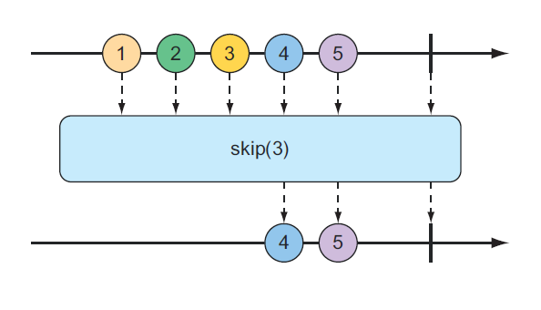
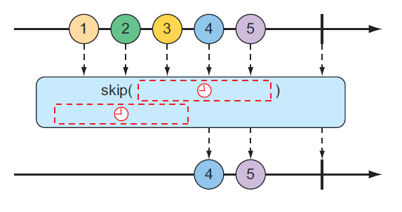
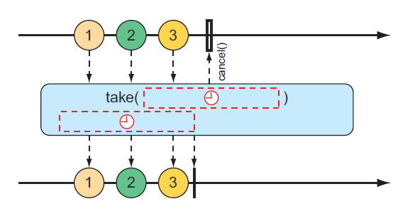
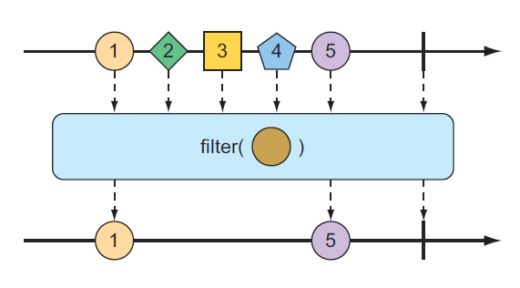
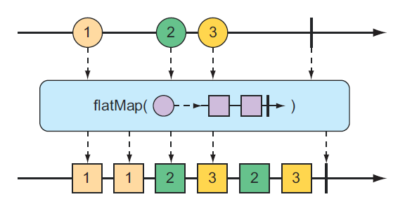
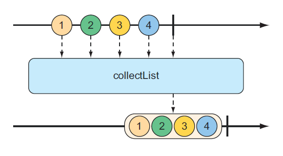

# 10.3.3 转换和过滤响应式流

当数据流过 stream，你可能需要过滤或是修改一些值。在本节中，我们将看到的是转换和过滤流过响应式流中的数据。

**从响应式类型中过滤数据**

当数据从 Flux 中流出时，过滤数据的最基本方法之一就是简单地忽略前几个条目。如图 10.10 所示，skip\(\) 操作正是这样做的。



给定一个包含多个条目的 Flux，skip\(\) 操作将创建一个新的 Flux，该 Flux 在从源 Flux 发出剩余项之前跳过指定数量的项。下面的测试方法演示如何使用 skip\(\)：

```java
@Test
public void skipAFew() {
    Flux<String> skipFlux = Flux.just(
        "one", "two", "skip a few", "ninety nine", "one hundred")
        .skip(3);

    StepVerifier.create(skipFlux)
        .expectNext("ninety nine", "one hundred")
        .verifyComplete();
}
```

在本例中，有五个字符串项的流。对该流调用 skip\(3\) 将生成一个新的流，该流跳过前三个项，并且只发布最后两个项。

你也许不是想跳过特定数量的项目，而是需要过一段时间再跳过前几个项目。skip\(\) 操作的另一种形式（如图 10.11 所示）是生成一个流，该流在从源流发出项之前等待一段指定的时间。



下面的测试方法使用 skip\(\) 创建一个在发出任何值之前等待 4 秒的 Flux。由于该 Flux 是从项之间具有 1 秒延迟（使用 delayElements\(\)）的 Flux 创建的，因此只会发出最后两个项：

```java
@Test
public void skipAFewSeconds() {
    Flux<String> skipFlux = Flux.just(
        "one", "two", "skip a few", "ninety nine", "one hundred")
        .delayElements(Duration.ofSeconds(1))
        .skip(Duration.ofSeconds(4));

    StepVerifier.create(skipFlux)
        .expectNext("ninety nine", "one hundred")
        .verifyComplete();
}
```

你已经看到了 take\(\) 操作的一个例子，但是根据 skip\(\) 操作，take\(\) 可以看作是 skip\(\) 的反面。skip\(\) 跳过前几个项，take\(\) 只发出前几个项（如图 10.12 所示）：

```java
@Test
public void take() {
    Flux<String> nationalParkFlux = Flux.just(
        "Yellowstone", "Yosemite", "Grand Canyon","Zion", "Grand Teton")
        .take(3);

    StepVerifier.create(nationalParkFlux)
        .expectNext("Yellowstone", "Yosemite", "Grand Canyon")
        .verifyComplete();
}
```


与 skip\(\) 一样，take\(\) 也有一个基于持续时间而不是项目计数的可选项。它会在一段时间之后，将接收并发出与通过源 Flux 一样多的项。如图 10.13 所示：



以下测试方法使用 take\(\) 的替代形式在订阅后的前 3.5 秒内发出尽可能多的项：

```java
@Test
public void take() {
    Flux<String> nationalParkFlux = Flux.just(
        "Yellowstone", "Yosemite", "Grand Canyon","Zion", "Grand Teton")
        .delayElements(Duration.ofSeconds(1))
        .take(Duration.ofMillis(3500));

    StepVerifier.create(nationalParkFlux)
        .expectNext("Yellowstone", "Yosemite", "Grand Canyon")
        .verifyComplete();
}
```

skip\(\) 和 take\(\) 操作可以看作是基于计数或持续时间的筛选条件的操作。对于更通用的 Flux 值过滤，会发现filter\(\) 操作非常有用。

给定一个决定一个项是否通过 Flux 的 Predicate，filter\(\) 操作允许你根据需要的任何条件有选择地发布。图 10.14 中的弹珠图显示了 filter\(\) 的工作原理。



要查看 filter\(\) 的运行情况，请考虑以下测试方法：

```java
@Test
public void filter() {
    Flux<String> nationalParkFlux = Flux.just(
        "Yellowstone", "Yosemite", "Grand Canyon","Zion", "Grand Teton")
        .filter(np -> !np.contains(" "));

    StepVerifier.create(nationalParkFlux)
        .expectNext("Yellowstone", "Yosemite", "Zion")
        .verifyComplete();
}
```

这里，filter\(\) 被赋予一个 Predicate，它只接受没有空格的 String。因此，“Grand Canyon” 和 “Grand Teton” 被过滤掉。

也许你需要过滤的是你已经收到的任何项目。distinct\(\) 操作（如图 10.15 所示）产生一个只发布源 Flux 中尚未发布的项的 Flux。


在下面的测试中，只有唯一的 String 值将从不同的 Flux 中发出：

```java
@Test
public void distinct() {
    Flux<String> animalFlux = Flux.just(
        "dog", "cat", "bird", "dog", "bird", "anteater")
        .distinct();

    StepVerifier.create(animalFlux)
        .expectNext("dog", "cat", "bird", "anteater")
        .verifyComplete();
}
```

尽管 “dog” 和 “bird” 分别从源 Flux 中发布两次，但在 distinct Flux 中只发布一次。

**映射响应式数据**

对于 Flux 或 Mono，最常用的操作之一是将已发布的项转换为其他形式或类型。Reactor 为此提供 map\(\) 和flatMap\(\) 操作。

map\(\) 操作会创建一个 Flux，该 Flux 在重新发布之前，按照给定函数对其接收的每个对象执行指定的转换。图 10.16 说明了 map\(\) 操作的工作原理。


在以下测试方法中，表示篮球运动员的 String 值的 Flux 映射到 Player 对象的新 Flux：

```java
@Test
public void map() {
    Flux<Player> playerFlux = Flux
        .just("Michael Jordan", "Scottie Pippen", "Steve Kerr")
        .map(n -> {
            String[] split = n.split("\\s");
            return new Player(split[0], split[1]);
        });

    StepVerifier.create(playerFlux)
        .expectNext(new Player("Michael", "Jordan"))
        .expectNext(new Player("Scottie", "Pippen"))
        .expectNext(new Player("Steve", "Kerr"))
        .verifyComplete();
}
```

给 map\(\) 的 Function 接口（作为 lambda）将传入 String 以空格进行拆分，并使用生成的字符串数组创建 Player 对象。虽然用 just\(\) 创建的流携带的是 String 对象，但是由 map\(\) 生成的流携带的是 Player 对象。

关于 map\(\) 的重要理解是，映射是同步执行的，因为每个项都是由源 Flux 发布的。如果要异步执行映射，应考虑使用 flatMap\(\) 操作。

flatMap\(\) 操作需要一些思考和实践才能变得很熟练。如图 10.17 所示，flatMap\(\) 不是简单地将一个对象映射到另一个对象，而是将每个对象映射到一个新的 Mono 或 Flux。Mono 或 Flux 的结果被压成一个新的 Flux。当与subscribeOn\(\) 一起使用时，flatMap\(\) 可以释放 Reactor 类型的异步能力。



下面的测试方法展示了 flatMap\(\) 和 subscribeOn\(\) 的用法：

```java
@Test
public void flatMap() {
    Flux<Player> playerFlux = Flux
        .just("Michael Jordan", "Scottie Pippen", "Steve Kerr")
        .flatMap(n -> Mono.just(n).map(p -> {
            String[] split = p.split("\\s");
            return new Player(split[0], split[1]);
        })
        .subscribeOn(Schedulers.parallel())
        );

    List<Player> playerList = Arrays.asList(
        new Player("Michael", "Jordan"),
        new Player("Scottie", "Pippen"Pippen"),
        new Player("Steve", "Kerr"));

    StepVerifier.create(playerFlux)
        .expectNextMatches(p -> playerList.contains(p))
        .expectNextMatches(p -> playerList.contains(p))
        .expectNextMatches(p -> playerList.contains(p))
        .verifyComplete();
}
```

请注意，flatMap\(\) 被赋予一个 lambda 函数，该函数将传入 String 转换为 String 类型的 Mono。然后对 Mono 应用 map\(\) 操作，将 String 转换为 Player。

如果你停在那里，产生的 Flux 将携带 Player 对象，以与 map\(\) 示例相同的顺序同步生成。但是对 Mono 做的最后一件事是调用 subscribeOn\(\) 来指示每个订阅应该在一个并行线程中进行。因此，可以异步和并行地执行多个传入 String 对象的映射操作。

尽管 subscribeOn\(\) 的名称与 subscribe\(\) 类似，但它们却截然不同。subscribe\(\) 是一个动词，它订阅一个响应式流并有效地将其启动，而 subscribeOn\(\) 则更具描述性，它指定了应该 _如何_ 并发地处理订阅。Reactor 不强制任何特定的并发模型；通过 subscribeOn\(\) 可以使用 Schedulers 程序中的一个静态方法指定要使用的并发模型。在本例中，使用了 parallel\(\)，它是使用固定大小线程池的工作线程（大小与 CPU 内核的数量一样）。但是调度程序支持多个并发模型，如下表所示：

| Schedulers 方法 | 描述 |
| :--- | :--- |
| .immediate\(\) | 在当前线程中执行订阅 |
| .single\(\) | 在单个可重用线程中执行订阅，对所有调用方重复使用同一线程 |
| .newSingle\(\) | 在每个调用专用线程中执行订阅 |
| .elastic\(\) | 在从无限弹性池中提取的工作进程中执行订阅，根据需要创建新的工作线程，并释放空闲的工作线程（默认情况下 60 秒） |
| .parallel\(\) | 在从固定大小的池中提取的工作进程中执行订阅，该池的大小取决于 CPU 核心的数量。 |

使用 flatMap\(\) 和 subscribeOn\(\) 的好处是，可以通过将工作分成多个并行线程来增加流的吞吐量。但由于这项工作是并行完成的，无法保证先完成哪项工作，因此无法知道产生的 Flux 中排放的项目的顺序。因此，StepVerifier 只能验证发出的每个项是否存在于 Player 对象的预期列表中，并且在 Flux 完成之前将有三个这样的项。

**在响应式流上缓冲数据**

在处理流经 Flux 的数据的过程中，你可能会发现将数据流分解成比特大小的块是有帮助的。buffer\(\) 操作（如图 10.18 所示）可以解决这个问题。


给定一个 String 值的 Flux，每个值都包含一个水果的名称，你可以创建一个新的 List 集合的 Flux，其中每个 List 的元素数不超过指定的数目：

```java
@Test
public void buffer() {
    Flux<String> fruitFlux = Flux.just(
        "apple", "orange", "banana", "kiwi", "strawberry");

    Flux<List<String>> bufferedFlux = fruitFlux.buffer(3);

    StepVerifier
        .create(bufferedFlux)
        .expectNext(Arrays.asList("apple", "orange", "banana"))
        .expectNext(Arrays.asList("kiwi", "strawberry"))
        .verifyComplete();
}
```

在这种情况下，String 元素的 Flux 被缓冲到一个 List 集合的新 Flux 中，每个 List 集合包含的项不超过三个。因此，发出 5 个 String 的原始 Flux 将转换为发出两个List 集合的 Flux，一个包含 3 个水果，另一个包含 2 个水果。

那又怎么样？将值从响应式 Flux 缓冲到非响应式 List 集合似乎适得其反。但是，当将buffer\(\) 与 flatMap\(\) 结合使用时，它可以并行处理每个 List 集合：

```java
Flux.just("apple", "orange", "banana", "kiwi", "strawberry")
    .buffer(3)
    .flatMap(x -> 
         Flux.fromIterable(x)
             .map(y -> y.toUpperCase())
             .subscribeOn(Schedulers.parallel())
             .log()
    ).subscribe();
```

在这个新示例中，仍然将 5 个 String 值的 Flux 缓冲到 List 集合的新 Flux 中，然后将 flatMap\(\) 应用于 List 集合的 Flux。这将获取每个 List 缓冲区并从其元素创建一个新的 Flux，然后对其应用 map\(\) 操作。因此，每个缓冲 List 在单独的线程中进一步并行处理。

为了证明它是有效的，我还包含了一个要应用于每个子 Flux 的 log\(\) 操作。log\(\) 操作只记录所有的 Reactor Streams 事件，这样你就可以看到真正发生了什么。因此，以下条目将写入日志（为了简洁起见，删除了时间组件）：

```text
[main] INFO reactor.Flux.SubscribeOn.1 - onSubscribe(FluxSubscribeOn.SubscribeOnSubscriber)
[main] INFO reactor.Flux.SubscribeOn.1 - request(32)
[main] INFO reactor.Flux.SubscribeOn.2 - onSubscribe(FluxSubscribeOn.SubscribeOnSubscriber)
[main] INFO reactor.Flux.SubscribeOn.2 - request(32)
[parallel-1] INFO reactor.Flux.SubscribeOn.1 - onNext(APPLE)
[parallel-2] INFO reactor.Flux.SubscribeOn.2 - onNext(KIWI)
[parallel-1] INFO reactor.Flux.SubscribeOn.1 - onNext(ORANGE)
[parallel-2] INFO reactor.Flux.SubscribeOn.2 - onNext(STRAWBERRY)
[parallel-1] INFO reactor.Flux.SubscribeOn.1 - onNext(BANANA)
[parallel-1] INFO reactor.Flux.SubscribeOn.1 - onComplete()
[parallel-2] INFO reactor.Flux.SubscribeOn.2 - onComplete()
```

日志条目清楚地显示，第一个缓冲区（apple、orange 和 banana）中的水果在 parallel-1 线程中处理。同时，在第二个缓冲区（kiwi 和 strawberry）中的水果在 parallel-2 线程中进行处理。从每个缓冲区的日志条目交织在一起这一事实可以明显看出，这两个缓冲区是并行处理的。

如果出于某种原因，需要将 Flux 发出的所有内容收集到 List 中，则可以调用不带参数的 buffer\(\)：

```java
Flux<List<List>> bufferedFlux = fruitFlux.buffer();
```

这将产生一个新的 Flux，该 Flux 会发出一个包含源 Flux 发布的所有项的 List。使用 collectList\(\) 操作也可以实现同样的功能，如图 10.19 中的弹珠图所示：



collectList\(\) 生成一个发布 List 的 Mono，而不是生成一个发布 List 的 Flux。以下测试方法说明了如何使用它：

```java
@Test
public void collectList() {
    Flux<String> fruitFlux = Flux.just(
        "apple", "orange", "banana", "kiwi", "strawberry");
    Mono<List<String>> fruitListMono = fruitFlux.collectList();

    StepVerifier
        .create(fruitListMono)
        .expectNext(Arrays.asList(
            "apple", "orange", "banana", "kiwi", "strawberry"))
        .verifyComplete();
}
```

一种更有趣的收集 Flux 发送的项目的方法是把它们存到 Map 中。如图 10.20 所示，collectMap\(\) 操作产生一个 Mono，它发布一个 Map，其中填充了由给定 Function 计算其键值的条目。


要查看 collectMap\(\) 的实际操作，请查看以下测试方法：

```java
@Test
public void collectMap() {
    Flux<String> animalFlux = Flux.just(
        "aardvark", "elephant", "koala", "eagle", "kangaroo");
    Mono<Map<Character, String>> animalMapMono =
        animalFlux.collectMap(a -> a.charAt(0));

    StepVerifier
        .create(animalMapMono)
        .expectNextMatches(map -> {
            return
                map.size() == 3 &&
                map.get('a').equals("aardvark") &&
                map.get('e').equals("eagle") &&
                map.get('k').equals("kangaroo");
        })
        .verifyComplete();
}
```

源 Flux 发出了一些动物的名字。在该 Flux 中，可以使用 collectMap\(\) 创建一个新的 Mono，该 Mono 发送一个 Map，其中的键值由动物名称的第一个字母确定，并且该值是动物名称本身。如果两个动物名以同一个字母开头（如 _elephant_ 和 _eagle_ 或 _koala_ 和 _kangaroo_），则流经流的最后一个条目将覆盖所有先前的条目。

