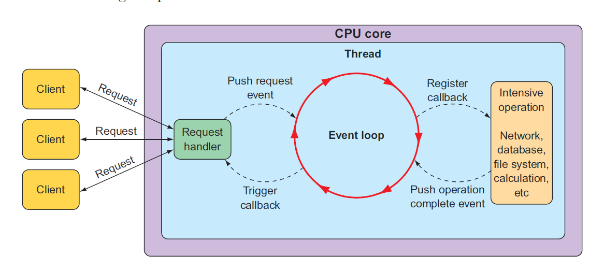

# 11.1 使用 Spring WebFlux

典型的基于 Servlet 的 web 框架，比如 Spring MVC，本质上是阻塞和多线程的，每个连接使用一个线程。在处理请求时，将从线程池中提取一个工作线程来处理该请求。同时，请求线程被阻塞，直到工作线程通知它已完成为止。

因此，在请求量很大的情况下，阻塞 web 框架不能有效地扩展。慢工作线程中的延迟使情况更糟，因为工作线程池准备处理另一个请求所需的时间更长。在某些用例中，这种工作方式是完全可以接受的。事实上，这在很大程度上是大多数 web 应用程序十多年来的开发方式，但时代在变。

这些 web 应用程序伴随着 HTTP API，已经从人们偶尔浏览网站成长为人们经常消费内容和使用应用程序。现在，所谓的 _物联网_（其中甚至没有人参与）产生的汽车、喷气发动机以及其他非传统的客户不断地通过 web API 交换数据。随着越来越多的客户使用 web 应用程序，扩展性比以往任何时候都更加重要。

相比之下，异步 web 框架实现用较少的线程达到更高的可扩展性，通常一个 CPU 一个线程。通过应用被称为 _event looping_ 的技术（如图 11.1 所示），这些框架的每个线程都能够处理许多请求，使得每个连接的成本低 。

在一个 event loop 中，一切皆为事件，其中包括像是数据库和网络操作这种密集操作的请求与回调。当需要完成一个重要的操作时，event loop 并行地为那个操作注册一个回调，然后它继续去处理其他事件。

当操作完成后，它会被 event loop 视为一个 event，对于请求也是一样的操作。这样异步 web 框架就能够使用更少的线程应对繁重的请求，从而实现更好的扩展性，这样做的结果就是降低了线程管理的开销。

Spring 5 已经基于 Project Reactor 推出了一个非阻塞异步 web 框架，以解决在 web 应用程序和 API 更大的可扩展性。让我们来看看 Spring WebFlux（一个响应式 web 框架）。

