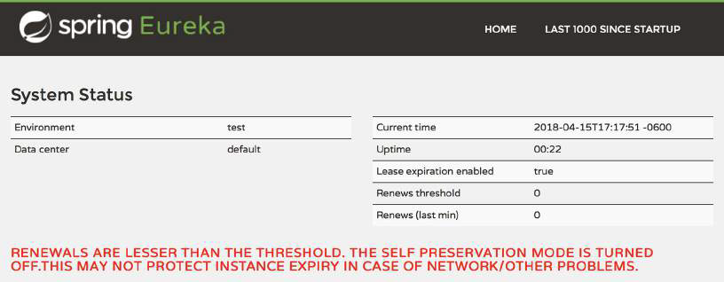

# 13.2.1 配置 Eureka

Eureka 不喜欢独立工作。Eureka 相信多副本更安全的概念，并希望成为 Eureka 服务集群的一部分。如果有不止一个 Eureka 服务，那么只要其中一个正常运行，就能消除单点故障。因此，Eureka 的默认行为就是试图与其他 Eureka 服务建立关联。它将尝试从其他 Eureka 服务获取注册信息，甚至在其他 Eureka 服务上注册自己。

在生产环境中，我们需要高可用性的 Eureka。但在开发环境，启动多个 Eureka 服务不方便，也没有必要。单个独立工作的 Eureka 服务足以满足开发环境的需求。但除非您正确配置了 Eureka 服务，否则它会不间断地尝试与其他 Eureka 服务建立联系。每隔30秒，会尝试与其他 Eureka 服务交换注册信息并相互注册，若出现问题则在日志文件中打印出异常。

您需要做的是，让 Eureka 知道自己是独立部署的。要做到这一点，您需要设置 `application.yml` 中的一些属性，如下所示:

```text
eureka:
  instance:
    hostname: localhost
  client:
    fetch-registry: false
    register-with-eureka: false
    service-url:
      defaultZone: http://${eureka.instance.hostname}:${server.port}/eureka
```

首先，设置 `eureka.instance.hostname` 属性为 localhost。这告诉 Eureka, 它在什么主机上运行。这是可选属性，如果您不设置，那么 Eureka 会尝试从环境变量中确定宿主主机地址。显式设置此属性能够让你更确定的知道它的实际值。

接下来的两个属性 `eureka.client.fetch-registry` 和 `eureka.client.register-with-eureka`，是您也可以在其他微服务上设置的属性，这会告诉它们应该如何与 Eureka 互动。请记住，Eureka 也是一个微服务，所以这些属性也可以设置在 Eureka 服务上。这告诉 Eureka 应如何与其他 Eureka 服务进行交互。

这两个属性的默认值都为 true ，表示 Eureka 应该从其他 Eureka 实例获取注册信息，并将自己注册为其他 Eureka 服务的服务。现在，我们的开发环境中，因为没有其他 Eureka 服务，您将它们设置为 false，这样 Eureka 就不会试图访问其他 Eureka 服务了。

最后，设置了 `eureka.client.service-url` 属性。此属性包含一组区域名称到 URL 的映射。每个区域可以设置多个 URL。`defaultZone` 键是一个特殊的区域名称，如果客户机（在本例中是 Eureka 本身）没有指定所需的区域，那么就使用此区域的值。因为只有一个 Eureka 实例，映射到默认区域的 URL 是用于 Eureka 服务本身的。这里的 URL 还使用了，可以用其他属性填充的占位符变量。

**指定 EUREKA 的服务端口**

尽管 Eureka 服务端口是选配的，但您可能希望覆盖默认设置。因为 Eureka 默认在端口 8080 上进行监听。如果您同时在本地计算机上运行几个应用程序（微服务），那这些应用程序就不能再监听 8080 端口了。因此，在开发环境中通常需要设置 Eureka 服务端口：

```text
server：
  port：8761
```

这里将端口设置为 8761，这是我们在后续章节（13.3 节）中开发的 Eureka 客户端的默认监听端口。

**禁用自我保护模式\*\***

您可以考虑设置的另一个属性是 `eureka.server.enable-self-preservation`。如果您启动 Eureka 服务并让它闲置超过一分钟左右，您可能会在 Eureka UI 中看到一条可怕的消息，如图 13.3 所示。



尽管使用了红色的大写字体，但这条消息并没有那么严重。Eureka 希望服务实例自己注册，并持续每 30 秒发送一次续订请求。通常，如果在三个续订期（或90秒）内，Eureka 没有收到一个服务的续订请求，它会注销该服务实例。我们这里的情况是，Eureka 假设存在网络问题，进入了自我保护模式，不会注销服务实例。

实际上，自我保护模式在生产环境中是一件好事。可以防止因网络抖动导致续订请求中断时，Eureka 注销了实际上还存活着的服务实例。但这条报错消息会让人非常吃惊，尤其是刚刚启动 Eureka，还没有注册任何服务的时候。您可以禁用自我保护模式，通过设置 `eureka.server.enable-self-preservation` 为 false：

```text
eureka:
  ...
  server:
    enable-self-preservation: false
```

这个属性在开发环境中很有用。因为在这种环境中，经常会发生 Eureka 收不到续订请求的情况，比如您可能频繁的启动或停止服务实例。而启用自我保护模式的结果是，在注册中心保留了已停止运行的服务实例。这样，当另一个服务试图使用早已消失的服务时，会产生更多问题。禁用自我保护模式会阻止这种奇怪的行为，然而，禁用的结果是会出现另一个红字信息（图 13.4）。


即使您决定在开发环境中禁用自我保护模式，您也应该在生产环境中启用它。

