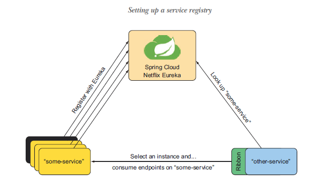
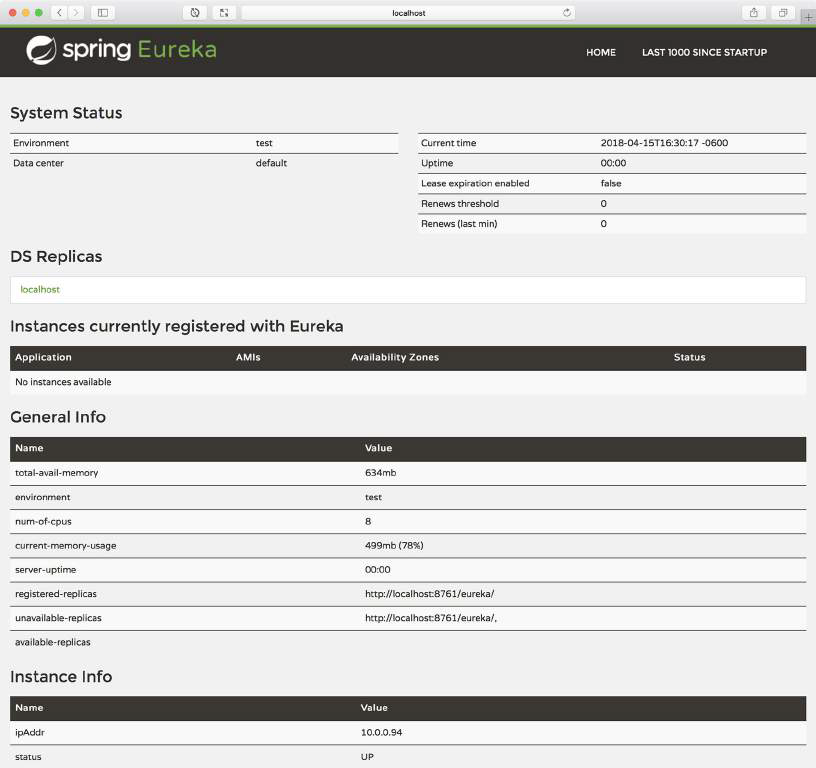

# 13.2 配置服务注册

Spring Cloud 是一个相当大的“一揽子”项目。它由几个独立的子项目组成，每一个都以某种方式支持微服务的开发。其中之一是 Spring Cloud Netflix 子项目，它提供了源自 Netflix 的几个组件。其中包括 Eureka，源自 Netflix 的服务注册中心。

## Eureka 背后的故事

Eureka 这个词表达的含义，是当一个人找到或发现某事时的一种喜悦的感叹。这个含义，使其成为服务注册中心的最合适的命名。微服务正是通过 Eureka 服务发现彼此。

传说 Eureka 是希腊物理学家阿基米德最先表达出来的。当年他坐在浴缸里洗澡时，发现了浮力的原理，便跳了出来，光着身子跑回家，大喊着“Eureka ！”

关于阿基米德是否真的大喊着“Eureka ！”跑回了家，还有一些争论。不过，这个故事倒是很有趣。不管怎样，我们现在可以与 Eureka 服务注册中心一起工作。

Eureka 充当微服务应用程序中，所有服务的中心注册表。Eureka 本身可以被认为是一个微型的服务，其目的是在更大的范围内帮助其他服务发现彼此。

由于它在微服务应用程序中，起着服务注册的作用，所以最好在创建任何需要注册到 Eureka 的服务之前，先把 Eureka 服务创建好。要了解 Eureka 的工作原理，可参考图 13.1 中描述的流程。

当一个服务实例启动时，它将用自己名称向 Eureka 注册。在图 13.1 中，服务名称代表某个服务。某个服务可能有多个等效实例，他们都以相同的名字在 Eureka 中注册。



在某个时候，另一个服务（在图 13.1 中称为 other-service）需要使用到某些服务（some-service）时，不是用硬编码的方式，调用以某个特定主机和端口代表的服务，而是在 Eureka 中通过名称查找服务。Eureka 回复它所知道的相关服务的所有实例信息。

现在 othere-service 需要做出决定。它将使用哪个服务实例？如果服务都是等价的，那没什么关系。但是为了避免每次都选择同一实例，最好应用一些客户端负载均衡算法以分散请求。这是另一个 Netflix 项目 Ribbon 专门解决的问题。

尽管 other-service 可能只负责查找和选择 some-service 的实例，但它也要依赖于 Ribbon。Ribbon 是客户端负载均衡器，用于对 some-service 进行选择。一旦 Ribbon 做出选择后，剩下的就是实际发送请求了。

## 为什么选择客户端负载均衡器？

通常，负载均衡器被认为是一个单一的、集中式服务，处理所有请求并将请求分发到目标的多个实例中。相反，Ribbon 是一个客户端负载均衡器，请求都是本地的客户端发出的。

作为客户端负载均衡器，Ribbon 比集中式负载均衡器有几个优点。因为每个客户端都有一个本地负载均衡器，所以扩展时，负载均衡器与客户端数量成比例。此外，每个负载均衡器可以配置为，使用最适合自己的负载均衡算法，而不是对所有服务应用相同的配置。

如果这看起来很复杂，不用担心。您很快就会看到，这其中大部分都是自动处理的，对用户是透明的。在注册和使用服务之前，您需要启用 Eureka 服务注册中心。

要开始使用 Spring Cloud 和 Eureka，您需要创建一个全新的 Eureka 服务项目。最简单的方法是使用 Spring Initializr。不管您想给这个项目取个什么样的名字，我是倾向于把它命名为 service-registry。当需要选择 starter 依赖项时，只有一个工作：勾选名称为 Eureka Server 的复选框。创建新项目之后，Initializr 会为您提供一个 pom.xml 文件，文件中包含以下依赖关系：

```markup
<dependency>
    <groupId>org.springframework.cloud</groupId>
    <artifactId>spring-cloud-starter-netflix-eureka-server</artifactId>
</dependency>
```

在 pom.xml 中，您还将看到一个名为 `spring-cloud.version` 的属性，以及在 `<dependencyManagement>` 部分指定的 Spring Cloud 的版本。当我创建注册中心服务时，它引用了`Finchley.SR1` 版本 ：

```markup
<properties>
    ...
    <spring-cloud.version>Finchley.SR1</spring-cloud.version>
</properties>

...
<dependencyManagement>
  <dependencies>
    <dependency>
      <groupId>org.springframework.cloud</groupId>
      <artifactId>spring-cloud-dependencies</artifactId>
      <version>${spring-cloud.version}</version>
      <type>pom</type>
      <scope>import</scope>
    </dependency>
  </dependencies>
</dependencyManagement>
```

如果您想使用 Spring Cloud 的其他版本，只需把 `spring-cloud.version` 属性设置为所需版本。

现在，构建中有了 Eureka starter 依赖项，您只需再做另外一件事，就可以启用 Eureka 服务。那就是在应用程序的主引导类上，添加 `@EnableEurekaServer` 注解：

```java
@SpringBootApplication
@EnableEurekaServer
public class ServiceRegistryApplication {

    public static void main(String[] args) {
        SpringApplication.run(ServiceRegistryApplication.class, args);
    }

}
```

这样就可以了！现在启动应用程序，将会运行 Eureka 注册服务，并监听 8080 端口。使用浏览器访问 [http://localhost:8080](http://localhost:8080)，您将看到如图 13.2 所示的界面。



Eureka 仪表盘信息很丰富，可以告诉您有哪些服务实例在 Eureka 上注册了。在使用注册中心的服务时，您会发现自己需要经常查看此 UI，以确保服务按照预期注册了。当然，到现在为止，我们还没有任何服务进行过注册，因此没有可用实例的任何信息。

Eureka 还提供了一个 REST API，通过 API 服务可以自行注册，并发现其他服务。您可能不会直接使用 REST API，但您会发现 `/eureka/apps` 接口很有用。它详细列出了所有注册的服务实例。此时，由于还没有注册过任何服务实例，所以会得到以下的返回信息。当您实际注册过服务以后，我们将在本章稍后的部分，重新查看这个接口的返回。

```markup
<applications>
    <versions__delta>1</versions__delta>
    <apps__hashcode></apps__hashcode>
</applications>
```

您可能已经注意到，Eureka 每隔 30 秒左右在其日志中记录了几个异常。别担心！Eureka 就是这样运行的。这些异常只是表示，您尚未完全配置好服务注册中心。让我们加上一些配置属性使这些异常消失吧。

