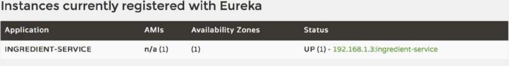

# 13.3.1 配置 Eureka 客户端属性

虽然本地开发时，在微服务中使用 Eureka 服务的默认位置 localhost 很适合，但一旦要把服务部署在本地主机之外，您就需要覆盖它的配置。更重要的是，那个默认服务名称 `UNKNOWN`，实在是一个可怕的选择。但说实话，使用任何其他的默认名称也一样，因为所有的服务都会有相同的名称。

更改微服务在 Eureka 中的注册名称，只需简单设置 `spring.application.name` 属性。例如，如果您要注册的服务，可以处理所有涉及 Taco Ingredient 的操作，那么您可以把它注册为 `ingredient-service`。在应用程序中的配置中，它应该是这样的：

```text
spring:
  application:
  name: ingredient-service
```

设置此属性后，就可以通过名称 `ingredient-service` 来查找该服务了。此外，如果您要启动多个 `ingredient-service` 的实例，它们都会出现在相同的名称下。这会有效地对服务进行水平扩展，以使消费服务可以选择多个等效的实例。在查看 Eureka 仪表盘时，服务将如图 13.5 所示。



使用 Spring Cloud 一段时间之后，您会发现 `spring.application.name` 属性是您需要设置的最重要的属性之一。它指定了在 Eureka 中的注册名称。在下一章中，您将看到配置服务使用这个名称来识别不同应用程序，进而管理不同应用程序的特定配置。其他 Spring Cloud 项目，如 Spring Cloud Task（定时任务服务）和 Spring Cloud Sleuth（分布式链路跟踪）也依赖于 `spring.application.name` 属性识别微服务。

正如您从第一章中了解到的那样， 在默认情况下，所有 Spring MVC 和 Spring WebFlux 应用程序都侦听端口 8080。因为您只会通过 Eureka 查找服务，所以这些应用程序在侦听哪个端口并不重要，因为 Eureka 知道他们在用哪个端口。因此，为了避免在本地运行时出现潜在的端口冲突，您可以将端口设置为 0：

```text
server:
  port: 0
```

> 注意：将端口设置为 0 会导致在启动应用程序时，随机选择可用端口。

现在，看看 Eureka 服务的位置配置。默认情况下，Eureka 客户端假定 Eureka 正在监听本地主机（端口 8761）。这在开发环境很适合，但在生产环境中不适用。因此，您需要指定 Eureka 服务的位置。这与您配置 Eureka 服务本身时一样，通过设置 `eureka.client.service-url` 属性：

```text
eureka:
  client:
    service-url:
      defaultZone: http://eureka1.tacocloud.com:8761/eureka/
```

这就配置了客户端要在 Eureka 服务上注册，并侦听主机 `eureka1.tacocloud.com`（端口8761）。只要这里指定的这个 Eureka 服务正常，这就能工作的很好。但如果这个 Eureka 服务因任何原因下线了，然后服务就无法注册了。为避免注册失败，最好使用两个或多个 Eureka 服务：

```text
 client:
   service-url:
     defaultZone: http://eureka1.tacocloud.com:8761/eureka/,
                  http://eureka2.tacocloud.com:8762/eureka/
```

当服务启动时，它会尝试向区域中的第一个 Eurreka 服务注册。如果由于一些原因注册失败了，那么它会尝试注册到列表中的下一个服务中。最终，当某个 Eureka 服务重新恢复时，它会从其他对等的点复制注册信息。

在 Eureka 注册一个服务只完成了一半的工作。一旦服务注册到 Eureka 后，其他服务就可以发现它们并开始使用它们。让我们看看如何使用在 Eureka 中注册的服务。

