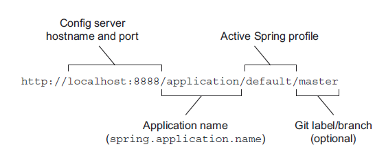

# 14.2.1 启动配置服务器

作为一个更大的应用系统中的一个微服务，Config Server 被部署为一个独立的应用。因此，您需要为 Config Server 新建一个工程。最简单的方法是，使用 Spring Initializr 或其他客户端（例如 `Spring Tool Suite` 中的 `New Spring Starter Project` 向导）。

> **配置：被赋予了多重含义的一个词**
>
> 当谈到 Spring Cloud Config Server 时，会大量使用“配置”这个词。它并不总是指同一个东西。会存在一些配置属性，用于 Config Server 本身。还有一些配置属性是 Config Server 要提供给您的应用程序的。甚至 Config Server 本身的名称中“Config”一词，也稍微增加了混淆的可能。 我尽量把这个说清楚，当我使用“配置”一词时，指的是应用程序的配置。对于 Config Server，我们使用缩写的“Config”一词
>
> 译者注：书中把 `configuration` 翻译成“配置”一词，而没有把 `Config Server` 翻译成 “配置服务”。所以我们没有英文版 `configuration`、`config` 这两个词容易混淆的问题。

我倾向于将新项目命名为“config-server”，但您也可以随便起别的名称。最重要的事情是，通过选中 `Config Server` 复选框来指定 Config Server 依赖关系。这将导致以下内容被添加到生成项目的 pom.xm 文件中：

```markup
<dependency>
  <groupId>org.springframework.cloud</groupId>
  <artifactId>spring-cloud-config-server</artifactId>
</dependency>
```

`Config Server` 的版本最终由 Spring Cloud 发布系列版本决定。这个值是必须在 pom.xml 文件中配置的。在我写本书时，最新的 Spring Cloud 发布版本为 `Finchley.SR1`。因此，您还可以在 pom.xml 文件中找到以下属性和 `<dependencyManagement>` 配置：

```markup
<properties>
  ...
  <spring-cloud.version>Finchley.SR1</spring-cloud.version>
</properties>

...

<dependencyManagement>
  <dependencies>
    <dependency>
      <groupId>org.springframework.cloud</groupId>
      <artifactId>spring-cloud-dependencies</artifactId>
      <version>${spring-cloud.version}</version>
      <type>pom</type>
      <scope>import</scope>
    </dependency>
  </dependencies>
</dependencyManagement>
```

尽管 Config Server 依赖项，将 Spring Cloud 添加到了项目的类路径中，但这不会通过自动配置来启用它。您需要对配置类添加 `@EnableConfigServer` 注解。顾名思义，此注解用来启用 Config Server。我通常只在主类上添加 `@EnableConfigServer`，如下所示：

```java
@EnableConfigServer
@SpringBootApplication
public class ConfigServerApplication {
  public static void main(String[] args) {
    SpringApplication.run(ConfigServerApplication.class, args);
  }
}
```

在启动应用程序之前，只需再做一件事：您必须告诉它，那些它要提供服务的配置属性在哪里可以找到。首先，您要使用 Git 存储库提供的配置，需要在 `spring.cloud.config.server.git.uri` 属性中，设置配置存储库的 URL ：

```yaml
spring:
  cloud:
    config:
      server:
        git:
          uri: https://github.com/tacocloud/tacocloud-config
```

您将在第 14.2.2 节中看到如何用属性填充 Git 存储库。

不过，您可能还需要为本地开发环境设置另一个属性。在本地测试您的服务时，您最终将在本地主机的不同端口上运行多个服务。作为一个典型的 Spring Boot 应用程序，在默认情况下，Config Server 将侦听端口 8080。为了避免端口冲突，您可以设置 `server.port` 属性:

```yaml
server:
  port: 8888
```

这里把服务端口设为 8888，是因为您将在 14.3 节中看到，这是配置客户端尝试检索配置的默认端口。您可以将其设置为任何其他值，但您需要确保，配置客户端使用相同的端口来获取配置。

重要的是要认识到，到目前为止您在本节中编写的配置，是 Config Server 本身的配置。这些配置属性不是 Config Server 提供给其他服务的。Config Server 将提供的是它从 Git 或 Vault 所拉取的配置。

此时，如果启动应用程序，Config Server 会侦听 8888 端口的请求，但它不会提供任何配置属性。虽然您还没有任何配置服务客户端，但可以使用 curl 命令行（或您选择的等效 HTTP 工具）发送请求：

```bash
$ curl localhost:8888/application/default
{
  "name": "application",
  "profiles": [
    "default"
  ],
  "label": null,
  "version": "ca791b15df07ce41d30c24937eece4ec4b208f4d",
  "state": null,
  "propertySources": []
}
```

这里是使用 **HTTP** GET 请求，对 Config Server 上的 `/application/default` 路径发送请求。此路径由两个或三个部分组成，如图 14.2 所示：



路径的第一部分 `application` 表示，发送请求的应用程序的名称。稍后将在 14.4.1 节中看到，Config Server 可以使用这部分，来对特定应用程序提供配置服务。现在您没有特定于应用程序的配置，所以任何值都可以。

路径中的第二部分表示，发送请求的应用程序当前正在使用的 `profile` 名称。在第 14.4.2 节中，我们将了解 Config Server 如何使用这部分，来对特定服务指定的 `profile` 提供配置。您还没有任何特定于 `profile` 的配置，因此任何名称都可以工作。

路径的第三部分（可选）表示，从后端 Git 存储库获取配置的标签或分支名称。如果未指定，则默认为 `master` 分支。

这个请求的响应值会给我们一些关于 Conffig Server 服务的基本信息，包括它后面配置的 Git 提交的版本和标签。当然，现在明显缺少任何实际的配置属性。正常情况下，你可以在 `propertySources` 属性中看到它们，但是现在这个属性是空的。这是因为您还没有用实际属性填充 Git 存储库。我们现在就来处理一下。

