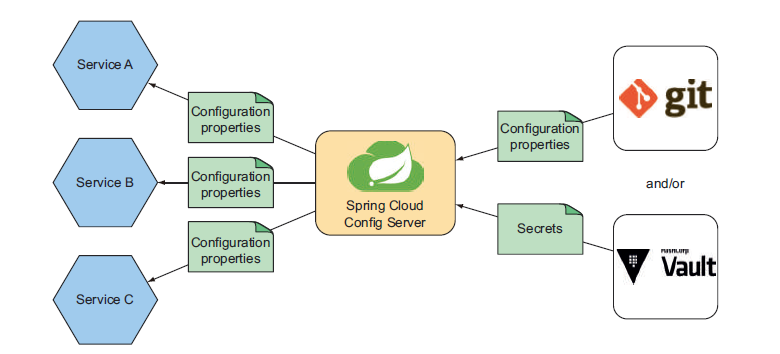

# 14.2 运行配置服务器

Spring Cloud Config Server 为配置数据提供了一个集中存储的地方。像 Eureka 那样，Config Server 可以被认为只是一个微服务，它在更大的应用程序中扮演的角色是，为其他服务提供配置数据服务。

Config Server 公开了一个 REST API，客户端（也就是其他微服务）可以通过 API 使用配置服务。Config Server 提供的配置信息存储在服务外部，通常位于版本控制系统中，如 Git。图 14.1 说明了其工作原理。

要注意图 14.1 有 Git 图标，但没有 `GitHub` 图标。这很重要，您可以使用 Git 的任何实现来存储配置，包括但不限于 `GitHub`、`GitLab`、`Microsoft’s Team Foundation Server` 或 `Gogs`，这些都是可以选择的。

> 请注意，尽管与 Config Server 一起配合的 Git 服务差别不大，但我用的是 Gogs \([http://gogs.io](http://gogs.io)\)，一个轻量级、易于安装的 Git 服务。更具体地说，我在开发机器上使用运行在 Docker 中的 Gogs，可参考 Gogs 使用指南 [https://github.com/gogits/ gogs/tree/master/docker](https://github.com/gogits/gogs/tree/master/docker)。

通过将配置存储在代码版本控制系统（如 Git ）中，配置可以进行版本控制、分支、标记、还原和追责，就像管理应用程序源代码一样。通过把配置与使用它的服务分离，配置就可以独立于应用程序进行修改和版本控制。

您可能还注意到图 14.1 中包含 `HashiCorp Vault`。保险库 （Vault） 非常有用，特别是在您希望提供的配置属性完全保密，直到需要时才放开的情况。我们将 14.5 节进一步讨论，如何使 Config Server 与 Vault 一起工作。

