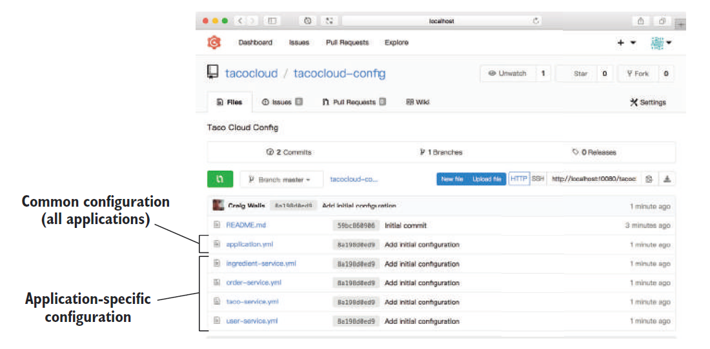

# 14.4.1 服务特定应用程序的属性

正如我们所讨论的，使用 Config Server 的好处之一，是您能够跨应用程序，为所有微服务提供共享的公共配置。尽管如此，通常也存在一些服务所特有的属性，是不需要（或不应该）在所有服务中共享的。

除了共享配置之外，Config Server 还能够管理针对特定应用程序的配置。诀窍是将配置文件的名称，与应用程序的 `spring.application.name` 属性，配置成一样的值。

在上一章中，您使用 `spring.application.name` 属性配置了微服务名称，用于在 Eureka 中注册。同样，这个属性在客户端访问 Config Server 时，也用于标识自己，以便 Config Server 可以提供特定于该应用程序的配置。

例如，在 Taco Cloud 应用程序中，您将应用程序拆分成一些微服务，比如 ingredient-service，order-service，taco-service， 和 user-service，您应该在每个服务中通过设置 `spring.application.name` 属性，指定这些服务的名称。然后就可以在 Config Server 的后端 Git 存储库上分别创建 YAML 配置文件。如：ingredient-service.yml, order-service.yml, taco-service.yml, and user-service.yml。下面的图 14.3 展示了 Gogs web 应用程序的配置库。

无论应用程序的名称是什么，所有应用程序都将接收来自 `application.yml` 文件的配置。但每个应用程序的 `spring.application.name` 属性设置的名称，将在请求 Config Server 时发送出去（作为请求路径的一部分）。如果有匹配的配置文件，那这些配置也将被返回。如果同样的属性在 `application.yml` 中，以及特定于应用程序的配置文件中，被重复定义了，那么特定于应用程序的配置中的属性将优先。

值得注意的是，尽管图 14.3 显示了 YAML 配置文件，但是如果将 properties 文件存入 Git 存储库，则也同样适用。

