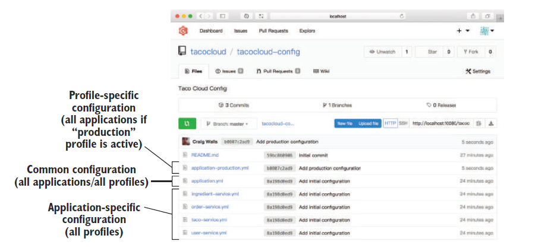
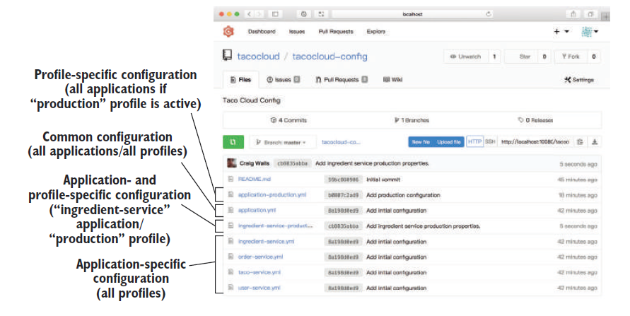

# 14.4.2 服务配置文件属性

您在第 5 章中看到了如何利用 Spring Profile，使某些属性仅在给定 profile 激活时才能够使用。Spring Cloud Config Server 支持特定于 profile 的属性配置。这与在单个 Spring Boot 应用程序中的使用方式完全相同。这包括：

* 提供特定于 profile 的 `.properties` 或 YAML 文件，比如 application-production.yml。
* 在单个 YAML 文件中包含多个 profile 配置组，使用3个中划线 `---` 和 `spring.profiles` 进行分隔。

例如，假设您现在通过 Config Server 为应用程序的所有微服务共享 Eureka 的配置。按目前的情况，它只指定了一个 Eureka 实例，这非常适合开发环境。但是，如果您的服务要在生产环境中运行，您可能希望对其进行配置，以便指定多个 Eureka 节点。

更重要的是，在开发环境中您把 `server.port` 属性设定为 0。一旦服务投入生产，它们就会在各自的容器中运行，并将容器内的端口 8080 映射到外部端口上，因此会要求所有应用程序都在端口 8080 上侦听。

使用 profile ，可以声明多个配置。除了把默认的 `application.yml` 文件推入 Config Server 的 Git 后端，您可以 推送另一个名为 `application-production.yml` 的 YAML 文件，看起来是这样的：

```yaml
server:
  port: 8080
eureka:
  client:
    service-url:
      defaultZone: http://eureka1:8761/eureka/,http://eureka2:8761/eureka/
```

当应用程序从 Config Server 获取配置时，它将标识出当前激活的 profile（在请求路径的第二部分）。如果当前激活的 profile 是 `production`，两套属性 `application.yml` 和 `application-production.yml` 将一起返回。`application-production.yml` 中的属性优先于 `application.yml` 中的属性。 图 14.4 显示了后端 Git 存储库可能的情况。



还可以指定同时特定于应用程序和 profile 的配置文件，和前面使用相同的命名约定。也就是说，配置文件分为三部分：应用名、中划线、profile 名称。

例如，假设您需要为名为 `ingredient-service` 的应用程序设置属性，并且仅当激活的 profile 为 `production` 时才适用。这种情况下，您的配置文件名应该为 `ingredient-service-production.yml`。里边可以包含特定于应用程序和特定于 profile 的属性，如图 14.5 所示。



特定于 profile 的配置文件，也可以使用 `.properties` 文件而不是 YAML 文件。在后端 Git 存储库中使用相同的命名约定进行存储。 当然，使用 YAML 文件时，可以在文件中定义特定于 profile 的属性，通过使用 3个中划线与 spring.profiles 分隔，这已经在 第五章中提过了。

