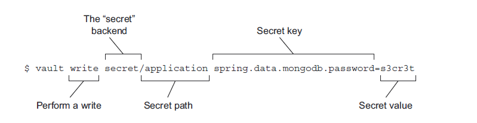

# 14.5.2 在 Vault 中存储密码

`HashiCorp Vault` 是一个机密管理工具。与 Git 相比，Vault 的核心功能是以本机方式来处理机密信息的。所以对于配置机密信息来说，使用 Vault 作为 Config Server 的后端存储，是一种更好的选择。

要开始使用 Vault，请参照 Vault 网站上的安装说明 [https://learn.hashicorp.com/tutorials/vault/getting-started-install](https://www.vaultproject.io/intro/getting-started/install.html)， 下载并安装 Vault 命令行工具。在本节中，将同时使用 vault 命令用于管理机密配置，以及启动 Vault 服务器。

```bash
$ vault server -dev -dev-root-token-id=roottoken
$ export VAULT_ADDR='http://127.0.0.1:8200'
$ vault status
```

第一个命令使用根令牌 （ID 是 roottoken）在开发模式下启动 Vault 服务器。开发模式，顾名思义，是一种简单但并不完全安全的模式。它不应该在生产环境中使用，但是在开发时使用非常有用，也更方便。

> 注意，Vault 服务器是一个功能强大，且非常健壮的机密管理服务器。本章没有足够的空间来详细讨论所有功能，只涉及在开发模式下简单使用 Vault 服务器。在将 Vault 投入生产环境之前，我强烈建议您通过阅读 Vault 文档，以了解 Vault 的详细信息 [https://www.vaultproject.io/docs](https://www.vaultproject.io/docs/index.html)。

对 Vault 服务器的所有访问都需要向服务器提供令牌。根令牌是一种管理令牌，它允许您创建更多令牌。它也可以用来读写机密信息。在开发模式下启动服务器时，如果没有指定根令牌，将自动生成一个并在启动时写入日志文件中。为了方便使用，建议把根令牌设置为一个易于记忆的值，如 roottoken。

Vault 服务器以开发模式启动以后，它将侦听本地端口 8200。也可以设置 `VAULT_ADDR` 环境变量，如前面的代码段中第二个命令所展示的那样，以修改配置。

最后，`vault status` 命令验证前两个命令是否按预期工作了。您应该收到一个列表，其中包含大约六个属性，描述 Vault 服务器的配置，以及 Vault 是否被封存。（Valulte 不应在开发模式下被封存。）

如果使用 Vault 0.10.0 或更高版本，您需要执行一些其他操作，以便适配 Vault 与 Config Server 一起工作。因为高版本的 Vault 工作方式有一些更改，会导致与 Config Server 标准机密后端存储不兼容。以下两个命令重新创建名称为 `secrets` 的后端存储，这样就和 Config Server 兼容了：

```bash
$ vault secrets disable secret
$ vault secrets enable -path=secret kv
```

如果使用旧版本的 Vault，则以上这些步骤不需要执行。

**保存机密信息到 Vault 中**

使用 Vault 命令可以轻松地将机密写入 Vault。例如，假设您想将 MongoDB 的密码使用属性 `spring.data.MongoDB.password`，保存到 Vault 而不是 Git 中。使用 vault 命令，可以像下面这样操作：



目前重要的是要注意这三个部分的信息：机密信息的路径、键和值。路径非常类似于文件系统路径，允许您对相关的秘密使用相同路径进行分组。路径的前缀 `secret/` 标识 Vault 后端（在本例中是名为“secret”的后端）

机密信息的键和值，是您正在向 Vault 写入的实际机密信息。当设置由 Config Server 提供服务的机密信息时，重要的是要使机密信息的键与配置属性的键完全一样。

您可以使用读取命令，验证写入的机密：

```bash
$ vault read secret/application
Key                             Value
---                             -----
refresh_interval                768h
spring.data.mongodb.password    s3cr3t
```

在向给定路径写入机密时，请注意，对给定路径的每次写入都将覆盖以前写入该路径的所有机密。例如，假设您又希望将 MongoDB 用户名写入到与前面的例子相同的 Vault 路径中。您不能简单地写入 `spring.data.mongodb.username`，这样做会导致原来的 `spring.data.mongodb.password` 信息丢失。您必须将它们同时写入：

```bash
% vault write secret/application \
        spring.data.mongodb.password=s3cr3t \
        spring.data.mongodb.username=tacocloud
```

现在您已经在 Vault 中存储了一些机密信息，让我们看看如何将 Vault 配置为 Config Server 的后端存储。

**在 Config Server 中配置 Vault 后端存储**

要将 Vault 添加为 Config Server 的后端存储，您需要做的是添加 vault 到当前激活的 profile 中。在 Config Server 的 `application.yml` 文件中，可以这样做：

```yaml
spring:
  profiles:
    active:
    - vault
    - git
```

如上所示，vault 和 git 都处于活动状态，这允许 Config Server 可以从 Vault 和 Git 获取属性配置。通常，您只需要将机密信息写入 Valult，对不需要保密的信息可以继续使用 Git。但如果您希望将所有配置写入 Vault，而不再使用 Git，您可以在 `spring.profiles.active` 中去除 Git，只设置为 vault。

默认情况下，Config Server 将假定 Vault 在本地主机上运行，并侦听 8200 端口。您可以在 Config Server 的配置中做更改：

```yaml
spring:
  cloud:
    config:
      server:
        git:
          uri: http://localhost:10080/tacocloud/tacocloud-config
          order: 2
        vault:
          host: vault.tacocloud.com
          port: 8200
          scheme: https
          order: 1
```

`spring.cloud.config.server.vault.*` 属性允许您覆盖 Config Server 使用 Vault 的默认值。在这里告诉 Config Server, Vault 的 API 地址为 [https://vault.tacocloud.com:8200。](https://vault.tacocloud.com:8200。)

注意，上述配置中仍然保存了 Git，这假设 Vault 和 Git 分担了提供配置的责任。order 属性指定了 Vault 提供的机密信息将优先于Git 提供的属性。Config Server 配置为使用 Vault 后端后，您可以通过 curl 命令模拟客户端调用：

```bash
[habuma:habuma]% curl localhost:8888/application/default | jq
{
  "timestamp": "2018-04-29T23:33:22.275+0000",
  "status": 400,
  "error": "Bad Request",
  "message": "Missing required header: X-Config-Token",
  "path": "/application/default"
}
```

不好！看起来像是出了什么问题！事实上，此错误表明 Config Server 正在从 Vault 中提供机密信息，但请求未包含 Vault 令牌。

所有 Vault 请求都应包含 `X-Vault-Token` 请求头。这不是在 Config Server 中配置该令牌，而是 Config Server 的客户端，在向 Config Server 发送请求时，要在请求头中包含 `X-Config-token`。然后 Config Server 会使用这个令牌，对 Vault 发出请求，同样将令牌放在请求头 `X-Config-Token` 中。

如您所见，由于请求中缺少令牌，Config Server 将拒绝提供配置服务，即使是来自 Git 的属性也不行。这是一个有趣的副作用，同时使用Vault 与 Git时，除非提供有效的令牌，否则 Git 属性都会被 Config Server 间接隐藏起来。

再次尝试一下，这次在请求头中添加 `X-Config-Token`：

```bash
$ curl localhost:8888/application/default
      -H"X-Config-Token: roottoken" | jq
```

请求中的 `X-Config-Token` 应该会得到很好的结果，包括 Vault 中的机密令牌。此处给出的令牌是您在开发模式下启动 Vault 服务器时指定的根令牌。它可以是任何在 Vault 服务器中创建的，未过期且已授予该权限访问 Vault 机密的令牌。

**在 Config Server 客户端中设置 Vault 令牌**

显然，您无法在每个微服务中使用 curl 来指定从 Config Server 中请求配置时所使用的令牌。您需要添加对每个应用程序的本地配置进行一点配置：

```yaml
spring:
  cloud:
    config:
      token: roottoken
```

`spring.cloud.config.token` 属性告诉 Config Server 客户端，它向 Config Server 发出请求时所使用的令牌值。此属性必须在应用程序的本地配置中设置（不存储在 Config Server 的 Git 或 Vault 后端），以便 Config Server 可以将其值传递到 Vault。

**写入特定于应用程序和 profile 的机密**

当 Config Server 提供服务时，写入 `application` 路径的机密会服务于所有应用程序，无论其名称如何。如果只需要对某些应用程序使用机密令牌，可将路径的 `application` 部分替换为具体的应用程序名称。例如，以下 Vault 写入命令将写入只特定服务于 `ingredient-service` 应用程序的机密。（名称由 `spring.application.name` 指定）：

```bash
$ vault write secret/ingredient-service \
              spring.data.mongodb.password=s3cr3t
```

同样，如果您没有指定 profile，写入 Vault 的机密将服务于默认 profile。也就是说，客户将接收这些秘密，而不管当前激活的 profile 是什么。您可以向特定的 profile 写入机密，像下面这样：

```bash
% vault write secret/application,production \
              spring.data.mongodb.password=s3cr3t \
              spring.data.mongodb.username=tacocloud
```

这样写入的机密信息，将只提供给当前激活的 profile 是 `production` 的应用程序。

