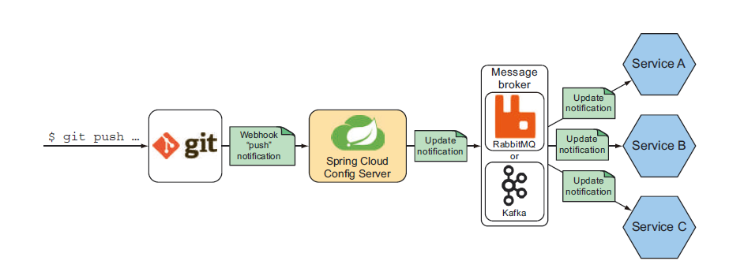
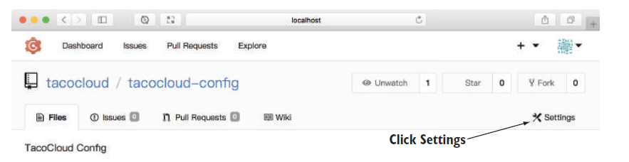
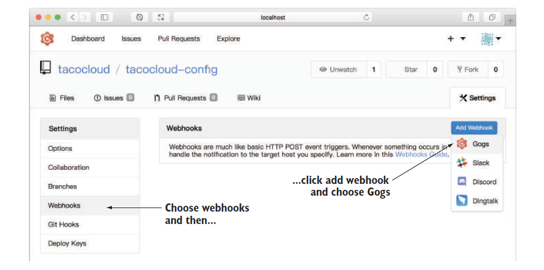
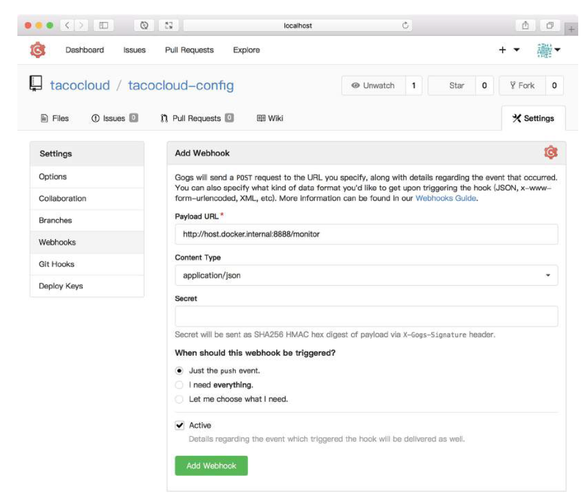

# 14.6.2 自动刷新配置属性

除了手动刷新应用程序配置以外，通过另一个名为 Spring Cloud Bus 的 Spring Cloud 项目，Config Server 可以自动通知所有客户端进行配置更改。图 14.7 展示了自动刷新配置的工作原理。



图 14.7 所示的属性刷新过程可以概括如下：

* 在配置 Git 存储库上创建一个 webhook，用来通知 Config Server 任何 Git 存储库的更改（如：push）。Webhooks 支持很多 Git 实现，包括 GitHub、GitLab、Bitbucket、Gogs。
* Config Server 通过广播消息来响应 webhook POST 请求，通过消息代理（如 RabbitMQ 或 Kafka）广播更改。
* 订阅通知的各个 Config Server 客户端应用程序，响应通知消息，使用来自 Config Server 的属性值刷新应用配置。

其效果是，所有使用 Config Server 的客户端应用程序都将始终具有最新配置，配置更改被推送到后端 Git 存储库后，各应用程序紧跟着进行刷新。

使用自动属性刷新时，需要几个部分同步工作。让我们整体看一下您将要进行的更改，以有一个更直观的理解：

* 您将需要一个消息代理来处理 Config Server 及其客户端之间的消息传递。比如选择 `RabbitMQ` 或 `Kafka`。
* 需要在后端 Git 存储库中创建一个 webhook 来通知 Config Server 相关修改。
* 需要使用 Config Server 监视器依赖项（它提供了接口，以处理来自 Git 存储库的调用请求），启用 Config Server 和 RabbitMQ 或 Kafka Spring Cloud Stream 依赖关系（用于向消息代理发布属性更改消息）。
* 除非消息代理以默认设置在本地运行，否则需要在 Config Server 及其客户端中，配置连接消息代理的详细信息。
* 每个 Config Server 客户端应用程序都需要 Spring Cloud Bus 依赖。

我将假设必备的消息代理（RabbitMQ 或 Kafka 等等）已经运行，并准备传递属性更改消息了。您要开始对配置进行修改，以触发 webhook 更新请求。

**创建 WEBHOOK**

许多 Git 服务器实现都支持创建 webhook。一旦对 Git 存储库进行更改（包括推送），就可以使用 webhook 来通知应用程序。 设置 webhook 的细节，会因为 Git 服务器实现不同而不同。我们很难都详细的讲到。下面通过在 Gogs 上配置 webhook 以让您了解整个过程。

我选择 Gogs 是因为它很容易在本地运行，并且可以通过 webhook 发送 POST 请求到到本地应用程序（GitHub 很难做到这一点）。也因为对 Gogs 设置 webhook 的过程，与在 GitHub 进行设置的过程基本一样。清楚了 Gogs 的设置过程，您就间接地了解了为 GitHub 设置 webhook 的过程。

首先，在 web 浏览器中访问配置存储库，并单击设置链接，如图 14.8 所示（设置链接的位置在 GitHub 中略有不同，但看起来比较类似。）



这将带您进入存储库的设置页面，左侧是分类设置菜单。从菜单中选择 Webhooks 将显示类似于图 14.9 的页面。



在 webhooks 设置页面中，单击 add webhook 按钮。在 Gogs，这将打开一个下拉列表，用于新建不同类型的 webhook。选择 Gogs 选项，如图 14.9 所示。然后，您将看到一个表单用来来创建一个新的webhook，如图 14.10 所示：



新建 webhook 表单有几个字段，最重要的两个字段是 `Payload URL` 和 `Content Type` 。很快您就能使 Config Server 来处理 webhook 的 POST 请求。那时，Config Server 能够处理对 `/monitor` 路径的请求。因此，`Payload URL` 字段应设置为指向 Config Server 的 `/monitor` 接口的 URL。因为我在 Docker 容器中运行 Gogs ，我在 图14.10 中给出的 URL 是 `http://host.docker.internal:8888/monitor`，其主机名为 `host.docker.internal`。此主机名使 Gogs 服务器能够访问到在主机上运行的 Config Server。

我还将 `Content Type` 字段设置为 `application/json`。这很重要，因为 Config Server 的 `/monitor` 接口不支持 `application/x-www-formurlencoded` 等其他选项。

如果设置了 `Secret` 字段，将在 webhook POST 请求中包含一个名为 `X-Gogs-Signature`（如果是 GitHub，则为 `X-Hub-Signature`）的请求头，值为 `HMAC-SHA256` 数字摘要（如果是 GitHub，则为 `HMAC-SHA1` 摘要）。现在，Config Server 的 `/monitor` 接口还无法识别这个签名头信息，因此您可以将此字段留空。

最后，您只关心将配置推送到配置存储库，并且希望 webhook 处于激活状态，所以您要确保事件单选按钮 `Just the Push Event` 和 `Active` 复选框被选中。单击 `Add Webhook` 按钮，webhook 将被创建。每当向存储库推送进行配置推送时，webhook 就会向 Config Server 发送 POST 请求。

现在您必须在 Config Server 中启用 `/monitor` 接口来处理这些请求。

**在 Config Server 中处理 WEBHOOK 更新**

在 Config Server 中启用 `/monitor` 接口，只需在工程中添加 `spring-cloud-config-monitor` 依赖。在 pom.xml 文件中添加以下内容：

```markup
<dependency>
  <groupId>org.springframework.cloud</groupId>
  <artifactId>spring-cloud-config-monitor</artifactId>
</dependency>
```

有了这个依赖，自动配置将启动 `/monitor` 接口。但是这还不够，除非 Config Sever 也有一种广播更改的能力。您还需要为 Spring 添加另一个依赖 `Spring Cloud Stream`。

`Spring Cloud Stream` 是 Spring Cloud 的又一个组件；它使各服务通过某种底层机制（比如：RabbitMQ 或 Kafka）进行通信。 这些服务编写的时候，并不知道他们是如何被使用的。他们从流中接收数据，然后进行处理。处理结束将处理结果返回到流，以供下游服务处理。或将接收的数据和处理结果都返回到流中。

`/monitor` 接口使用 `Spring Cloud Stream` 发送通知消息到相关的 Config Server 客户端。为了避免硬编码任何特定的消息实现，monitor 充当 `Spring Cloud Stream` 发布消息入口，并让底层实现来具体处理发送消息的细节。

如果您使用的是 RabbitMQ，则需要在 Config Server 中包含 `Spring Cloud Stream RabbitMQ` 依赖：

```markup
<dependency>
  <groupId>org.springframework.cloud</groupId>
  <artifactId>spring-cloud-starter-stream-rabbit</artifactId>
</dependency>
```

如果您更喜欢 Kafka，就需要 Spring Cloud Stream Kafka 依赖项：

```markup
<dependency>
  <groupId>org.springframework.cloud</groupId>
  <artifactId>spring-cloud-starter-stream-kafka</artifactId>
</dependency>
```

有了这些依赖项，Config Server 就差不多可以参与自动刷新配置属性了。事实上，如果 RabbitMQ 或 Kafka 的代理，使用默认配置运行在本地， Config Server 现在就可以很好的运行。但是如果代理运行在其他主机上，并且使用了某个非默认端口，或者您已经更改了访问代理的凭据，则需要在 Config Server 中设置一些配置属性。

使用 RabbitMQ 时，可以在 application.yml 中设置以下属性替代默认值：

```yaml
spring:
  kafka:
    bootstrap-servers:
    - kafka.tacocloud.com:9092
    - kafka.tacocloud.com:9093
    - kafka.tacocloud.com:9094
```

您在第 8 章中看到过这些属性，我们在第 8 章中讨论了 Kafka 消息服务。实际上，为自动刷新配置使用 RabbitMQ 或 Kafka 的方式，和在其他用途中使用它们的方式是一样的。

**创建 GOGS 通知提取程序**

每个 Git 实现在处理 webhook POST 请求时，都有自己的特性。所以 `/monitor` 接口要能够理解 webhook POST 请求时的不同数据格式。在 `/monitor` 接口底层是一组组件，它检查 POST 请求，尝试确定请求来自哪种 Git 服务器，并将请求数据映射到一种公共的数据类型中，以发送给每个客户端。

Config Server 提供了对几种流行 Git 实现的支持，比如 GitHub、GitLab 和 Bitbucket。如果您用的是这些 Git 实现，就不需要任何特殊处理。当我写这篇文章时，Gogs 还没有正式发布。因此，如果您使用 Gogs 作为 Git 实现，您需要一个特定于 Gogs 的通知提取程序。

下一个清单显示了为 Taco Cloud 实现的 Gogs 通知提取器。


```java
package tacos.gogs;
import java.util.Collection;
import java.util.HashSet;
import java.util.Map;
import java.util.Set;
import org.springframework.cloud.config.monitor.PropertyPathNotification;
import org.springframework.cloud.config.monitor.PropertyPathNotificationExtractor;
import org.springframework.core.Ordered;
import org.springframework.core.annotation.Order;
import org.springframework.stereotype.Component;
import org.springframework.util.MultiValueMap;

@Component
@Order(Ordered.LOWEST_PRECEDENCE - 300)
public class GogsPropertyPathNotificationExtractor
    implements PropertyPathNotificationExtractor {

  @Override
  public PropertyPathNotification extract(
      MultiValueMap<String, String> headers,
      Map<String, Object> request) {
    if ("push".equals(headers.getFirst("X-Gogs-Event"))) {
      if (request.get("commits") instanceof Collection) {
        Set<String> paths = new HashSet<>();
        @SuppressWarnings("unchecked")
        Collection<Map<String, Object>> commits =
            (Collection<Map<String, Object>>) request.get("commits");
            for (Map<String, Object> commit : commits) {
                addAllPaths(paths, commit, "added");
                addAllPaths(paths, commit, "removed");
                addAllPaths(paths, commit, "modified");
            }
            if (!paths.isEmpty()) {
                return new PropertyPathNotification(
                    paths.toArray(new String[0]));
            }
        }
    }
    return null;
  }

  private void addAllPaths(Set<String> paths,
                Map<String, Object> commit,
                String name) {
    @SuppressWarnings("unchecked")
    Collection<String> files = (Collection<String>) commit.get(name);
    if (files != null) {
        paths.addAll(files);
    }
  }
}
```


`GogsPropertyPathNotificationExtractor` 的实现细节和我们要讨论的内容不是太相关。一旦 Spring Cloud Config Server 内置支持了 Gogs 时，就更不需要关注了。因此，这里就不多说了。如果有兴趣，可以自己看一下。

**在 Config Server 客户端中启用自动刷新**

在 Config Server 客户端中启用自动属性刷新非常简单，只需要一个依赖项：

```markup
<dependency>
  <groupId>org.springframework.cloud</groupId>
  <artifactId>spring-cloud-starter-bus-amqp</artifactId>
</dependency>
```

这会将 AMQP（例如，RabbitMQ） `Spring Cloud Bus` 添加到项目中。如果您使用的是 Kafka，则应改用以下依赖项：

```markup
<dependency>
  <groupId>org.springframework.cloud</groupId>
  <artifactId>spring-cloud-starter-bus-kafka</artifactId>
</dependency>
```

项目中有了 `Spring Cloud Bus` 以后，应用程序在启动时自动配置将会触发，会自动绑定到本地运行的 RabbitMQ 或 Kafka 群集的 Broker 上。如果您的 RabbitMQ 或 Kafka 在其他地方运行，那么您将需要在 Config Server 的客户端进行适当的配置，就像在 Config Server 上配置时那样。

现在，Config Server 及其客户端都配置为自动刷新了。启动所有工程，通过修改 `application.yml` （任何修改）让它运转起来。当您把修改推到 Git 存储库时，您将立即在客户端应用程序中发现修改生效。

