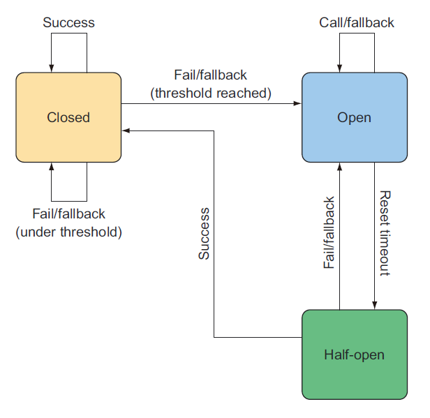

# 15.1 了解断路器

在《发布！软件的设计与部署》一书的第二版，Michael Nygard 阐述了这样的事实：就是我们编写的代码总会出错。断路器模式很有用，主要的原因是，当代码运行失败时，它会优雅地失败。这种强大的模式在微服务环境中更为重要，因为它可以避免故障级联跨越到分布式调用的整个链路中。

断路器模式的概念相对简单，这非常类似一个真实世界的电子断路器，它的名字也来源于此。在带有断路器的电路中，当开关处于闭合位置时，电流流动，给灯、电视、电脑等电器供电。但是如果线路有任何异常，比如电涌，断路器会断开，在电流损坏电子设备或引起火灾之前停止电流流动。

同样，软件断路器在闭合状态下启动，允许调用方法。如果由于一些原因，该方法失败（可能超过定义的阈值），断路器断开，不再对故障方法执行调用。然而，软件断路器的不同之处在于，它还提供了降级行为和自我纠正能力。

如果受保护的方法失败次数达到给定的失败阈值，则可以调用降级方法。一旦断路器断开，请求就全部调用降级方法。然而，每隔一段时间，调用链路就会进入半开状态，并尝试调用失败的方法。如果仍然失败，将恢复断开状态。如果成功了，那么就假定问题已经解决了。回到闭合状态。图 15.1 说明了软件断路器的状态变化流程。

把断路器模式看作是一种更强大的 `try/catch`，会有助于您理解。闭合电路类似于 `try` 代码块，而降级方法类似于 `catch` 代码块。然而，与 `try/catch` 不同，断路器足够智能，在预期的方法失败得太频繁时，会绕过预期方法而调用降级方法。

正如我所暗示的，断路器应用于方法上。微服务内很容易有几个或十几个（或更多）的断路器。决定在哪里的代码中声明断路器，是一个先要识别出哪里的方法可能失败的问题。以下几种方法是使用断路器的典型方法：

* 进行 REST 调用的方法——这种方法可能会失败，因为远程服务可能不可用或返回 HTTP 500 响应。
* 执行数据库查询的方法——这种方法可能会失败，因为一些原因数据库可能无响应，或者表结构变化使用应用程序报错。
* 执行速度慢的方法——执行慢也不一定就失败，但如果执行时间太长的话，可以认为是不正常的。

最后一项强调了断路器除了处理故障之外的另一个好处。在微服务中，延迟也是一个重要的关注点。关键是要使慢方法不要拖累微服务的性能，导致上游服务产生级联延迟。

正如你所见，断路器模式用一个难以置信的强大手段，优雅地处理代码中的失败和延迟。我们怎样才能把断路器用在我们的代码中呢？幸运的是，Netflix 开源项目提供了 Hystrix 库。

Netflix Hystrix 是断路器模式的 Java 实现。简单地说，Hystrix 断路器被实现为应用在方法上一个切面：如果目标方法失败，则触发降级方法。为正确实施断路器模式，切面还跟踪目标方法的失败频率，如果失败率超过一些阈值，是触发降级方法。

 **HYSTRIX 名称的来历**

Netflix 的开发人员在为他们的断路器实现命名时，他们希望有一个能体现弹性、防御和容错能力的名字。他们选择了 `Hystrix`。这是一种能用长棘刺自卫的，生活在东半球的豪猪。另外，正如 Hystrix 常见问题解答中所解释的，这名称听起来很酷。当我们在第 15.3.1 节查看 Hystrix 仪表板时，您将看到项目标志是一只豪猪。

Spring Cloud Netflix 包含了对 Hystrix 的支持，提供了 Spring 和 Spring Boot 开发人员都熟悉的简单编程模型。在方法上声明断路器只需用 @HystrixCommand 注解，并提供了一个降级方法。让我们看看在 Taco Cloud 的代码中，如何使用 Hystrix 断路器优雅地处理失败。

