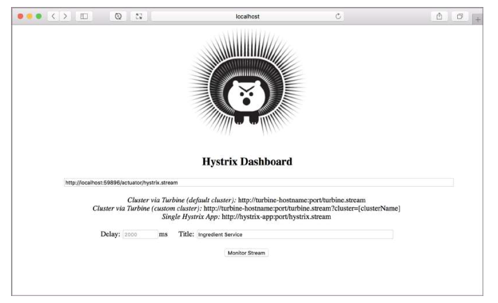
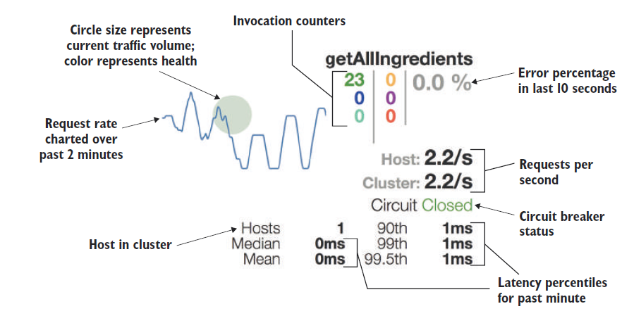

# 15.3.1 介绍 Hystrix 面板

要使用 Hystrix 仪表板，首先需要创建一个新的 Spring Boot 应用程序，并添加 Hystrix 仪表板依赖。如果您使用 Spring Boot Initializr 创建项目，可以勾选 Hystrix Dashboard 复选框。否则，需要将以下 `<dependency>` 添加到项目的 Maven pom.xml文件中：

```markup
<dependency>
  <groupId>org.springframework.cloud</groupId>
  <artifactId>spring-cloud-starter-netflix-hystrix-dashboard</artifactId>
</dependency>
```

项目初始化之后，还需要启用 Hystrix 仪表板，通过在主配置类上添加 `@EnableHystrixDashboard` 注解实现：

```java
@SpringBootApplication
@EnableHystrixDashboard
public class HystrixDashboardApplication {
  public static void main(String[] args) {
    SpringApplication.run(HystrixDashboardApplication.class, args);
  }
}
```

在开发环境，您可以在本地机器上同时运行多个服务，包括 Hystrix 仪表板、Eureka 和 Config Server 等。为了避免端口冲突，您需要为 Hystrix 仪表板选择一个唯一的端口。在仪表板应用程序的 `application.yml` 文件中，将 `server.port` 属性设置为任何唯一的值。我通常把它设置为 7979，比如：

```yaml
server:
  port: 7979
```

现在就准备好启动 Hystrix 仪表板了。一旦成功运行，打开 web 浏览器访问 [http://localhost:7979/hystrix](http://localhost:7979/hystrix)。您应该可以看到 Hystrix 仪表板主页，如图 15.2 所示。



关于 Hystrix 仪表板主页，您首先会注意到的是标志，一个卡通豪猪吉祥物。需要查看 Hystrix 流时，要在文本框中输入 Hystrix 流的 URL。例如，如果 ingredient 服务在 localhost 上运行并正在侦听在端口 59896 上（因为把 `server.port` 设置为 0 了），要在文本框中输入 `http://localhost:59896/actuator/hystrix.stream`。

您还可以设置要在 Hystrix 流监视页面显示的延迟和标题。这个延迟，默认为 2 秒，这是轮询周期时间，这会有效地减慢流的速度。标题仅用于在监视页面上显示。一般情况下，默认值就是非常好的。

单击 `Monitor Stream` 按钮，跳转到 Hystrix 流监视页面。您应该看到一个类似于图 15.3 的页面。


每一个断路器都可以被看作是一个图形，以及一些其他有用的指标数据。图 15.3 显示了 `getAllIngredients()` 的单个断路器，因为 这是迄今为止您声明的唯一一个断路器。

如果没有看到任何代表断路器的图形，看到的只是文字 `Loading`，这可能是因为没有断路器方法被调用过。您必须向将触发断路器的服务发出请求调用，以便使仪表板显示该方法的断路器度量指标。图 15.4 更仔细地展示了单个断路器监视器，提供了监视信息的细节条目。



监视器最引人注目的部分是左上角的图形。这个折线图表示，给定方法在过去 2 分钟内的调用量，展示了该方法有多繁忙的简要历史。

图形的背景有一个大小和颜色波动的圆。圆圈大小表示当前调用量大小；圆圈越大，调用量越高。圆圈的颜色表示它的健康程度。绿色表示很健康，黄色表示健康，但偶尔出现故障，红色表示断路器故障。

监视器的右上角用三列显示了各种计数器。在最左边的列从上到下，第一个数字（绿色）显示了当前有多少次调用是成功的。第二个数字（蓝色）是短路请求的数量。最后一个数字（青色）是错误请求的计数；中间一栏数字，表示超时的请求数（黄色），线程池拒绝的数目 （紫色）和失败请求数（红色）；第三列显示百分比，表示过去 10 秒内的错误数占比。

计数器下面是表示每秒请求数的两个数字，主机和集群。这两个请求速率下面显示的是断路器状态。最底部显示了延迟的中位数和平均值，以及延迟的第 90、 99 和 99.5 百分位数。

