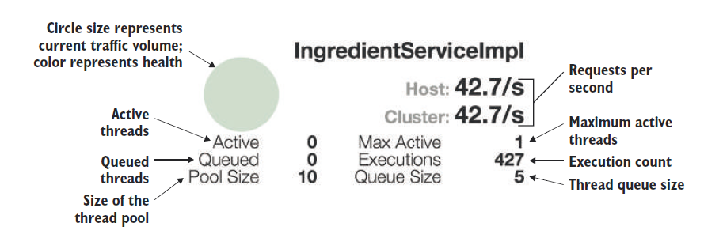

# 15.3.2 了解 Hystrix 线程池

假设有一个方法要花费了大量的时间来完成它的工作，比如是向另一个服务发送 HTTP 请求，而别的服务运行缓慢，在服务响应之前，Hystrix 会阻塞线程，一直等待响应。

如果调用方法与响应缓慢的方法是在同一个上下文中，那调用方法就没有机会绕开响应缓慢的方法。此外，如果阻塞的线程是一组有限的线程中的一个，例如来自 Tomcat 的请求处理线程。当响应缓慢问题持续存在时，大量线程都在等待响应。很明显这里会有扩展性问题。

为了避免这种情况，Hystrix 为每个依赖项分配一个线程池。当调用其中一个 Hystrix 命令方法时，它将在 Hystrix 托管线程池，将其与调用线程隔离。如果被调用线程需要太长时间返回结果，允许调用线程放弃或绕过调用。这就隔离了 Hystrix 托管线程池，保证不会出现任何潜在的线程饱和现象。

您可能已经注意到，在断路器监视页面，图 15.3 在页面底部显示另一个监视器，标题为 Thread Pools。这部分包括了每个 Hystrix 托管线程池的监视器。图 15.5 显示了一个单独的线程池监视器，并对其进行了注释以描述它所呈现的数据。

与断路器监视器非常相似，每个线程池监视器左上角都包含一个圆。这个圆的大小和颜色表示线程池的活跃和健康程度。但与断路器监视器不同，线程池监视器不显示线程池活动状况的折线图。

线程池的名称显示在统计信息右上角。统计信息上边是线程池每秒处理的请求数。线程池监视器的左下角显示以下内容信息：

* 活动线程计数——当前活动的线程数。
* 排队线程计数——当前排队的线程数。默认情况下，队列是禁用的，因此此值始终为 0。
* 线程池大小——线程池中有多少个线程。

同时，右下角显示有关线程池的以下信息：

* 最大活动线程计数——在当前采样周期内，整个进程中活动线程的最大数目。
* 执行计数——线程池中的线程被调用，来处理 Hystrix 命令的执行次数。
* 队列大小——线程池队列的大小。线程队列在默认情况下被禁用，因此该值没有什么意义。

值得注意的是，作为 Hystrix 线程池的替代方案，您可以选择使用信号量隔离。然而，信号量隔离不在本章的讨论范围之内。请参阅 Hystrix 文档以了解更多信息。

现在，您已经看到了 Hystrix 仪表板。让我们考虑有多个断路器数据流的情况。看看如何处理多个流，以及如何将它们聚合为一个在 Hystrix 仪表板中可查看的流。

