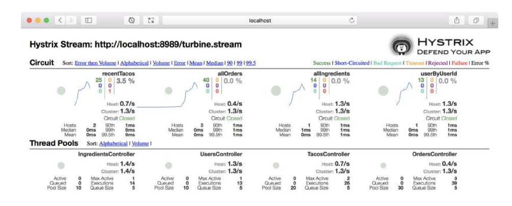

# 15.4 聚合多个 Hystrix 流

Hystrix 仪表板一次只能监视一个流。而每个微服务的每个实例，都会发布自己的 Hystrix 流，这样的话就很难了解应用程序的整体运行状况。

幸运的是，Netflix 的另一个项目 `Turbine`, 提供了聚合所有 Hystrix 微服务流到单个流的能力，这样就能在 Hystrix 仪表板进行监视了。Spring Cloud Netflix 支持 Turbine 服务的方式，类似于创建其他 Spring Cloud 服务。要创建 Turbine 服务，可以创建一个新的 Spring Boot 项目，并包含以下依赖项：

```markup
<dependency>
  <groupId>org.springframework.cloud</groupId>
  <artifactId>spring-cloud-starter-netflix-turbine</artifactId>
</dependency>
```

> 注意：使用 Initializr 创建新的 Spring Boot 项目时，只需选中 `Turbine` 复选框。

创建完项目以后，需要启用 Turbine。为此，要添加 `@EnableTurbine` 注解到应用程序的主配置类上：

```java
@SpringBootApplication
@EnableTurbine
public class TurbineServerApplication {
  public static void main(String[] args) {
    SpringApplication.run(TurbineServerApplication.class, args);
  }
}
```

在开发环境中，会同时在本地运行 Turbine，以及其他 Taco Cloud 服务。为了避免端口冲突，您需要选择一个唯一的端口。可以使用您喜欢的任何唯一端口，我倾向于选择 8989 端口：

```yaml
server:
  port: 8989
```

Turbine 服务消费来自于多个微服务的流数据，并把断路器度量指标聚合成一个单一的流数据。它可以充当 Eureka 的客户端，自动发现要聚合到自己流中的服务。但 Turbine 并不假设它应该聚合在 Eureka 注册的所有服务的流数据。您必须配置 Turbine，以告知它应该聚合哪些服务的数据。

`turbine.app-config` 属性接受逗号分隔的服务名称列表。这个列表用于在 Eureka 查找应该聚合 Hystrix 流的服务。对于 Taco Cloud，您需要 Turbine 来聚合在 Eureka 注册的四个服务的流：ingredient-service、taco-service、order-service、user-service。以下是在 application.yml 中设置 `turner.app-config` 的示例：

```yaml
turbine:
  app-config: ingredient-service,taco-service,order-service,user-service
  cluster-name-expression: "'default'"
```

请注意，除了 `turbine.app-config` 属性之外，还设置 `turbine.cluster-name-expression` 为 `'default'`。这表明 Turbine 应收集所有流到名称为 `'default'` 的集群流下面。设置此集群非常重要，否则 Turbine 流将不会包含从指定应用程序中聚合来的数据。

现在您可以启动 Turbine 服务，并访问 Hystrix 仪表板 [http://localhost:8989/turbine.stream](http://localhost:8989/turbine.stream)。来自指定应用程序的，所有断路器信息将显示在断路器仪表板中。图 15.6 显示了可能的情况。



现在，Hystrix 仪表板显示了来自所有服务的、所有断路器的运行状况信息。有了 Turbine，您就有了一站式服务，可以监视 Taco Cloud 应用程序中所有微服务的、所有断路器的运行状况。

