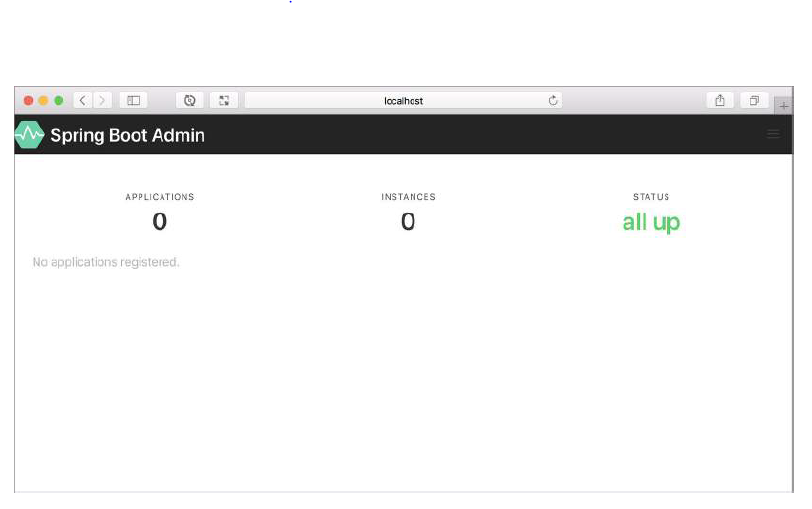

# 17.1.1 创建 Admin 服务端

要启用 Admin 服务端，首先需要创建一个新的 Spring Boot 应用程序，并将 Admin 服务端依赖项添加到项目的构建中。Admin 服务端通常是作为独立应用程序使用的，与其他应用程序分开。所以，最简单的方法是，使用 Spring Boot Initializr 创建一个新的 Spring Boot 项目，并选中标记为 Spring Boot Admin（服务端）的复选框。这样就会在 `<dependencies>` 中包含以下依赖：

```markup
<dependency>
  <groupId>de.codecentric</groupId>
  <artifactId>spring-boot-admin-starter-server</artifactId>
</dependency>
```

接下来，您需要通过在主配置类上添加 @EnableAdminServer 注解，以启用 Admin 服务端，如下所示：

```java
package tacos.bootadmin;
import org.springframework.boot.SpringApplication;
import org.springframework.boot.autoconfigure.SpringBootApplication;
import de.codecentric.boot.admin.server.config.EnableAdminServer;

@SpringBootApplication
@EnableAdminServer
public class BootAdminServerApplication {
  public static void main(String[] args) {
    SpringApplication.run(BootAdminServerApplication.class, args);
  }
}
```

最后，因为 Admin 服务端可能不是唯一一个在本地运行的应用程序，您应该设置共用使用一个唯一的端口（不能是端口0）。在这里，我选择端口 9090 作为 Spring Boot Admin 服务端的端口：

```yaml
server:
  port: 9090
```

> 注意：与微服务架构中的任何其他服务应用程序一样，在 Spring Boot 应用程序中，server.port 属性可以在不同的配置文件中设置不同的值，最终使用的端口值会由底层平台机制决定。

现在，您的 Admin 服务端已准备就绪。如果您在此时启动它，并在您的 web 浏览器访问 [http://localhost:9090](http://localhost:9090)，您会看到类似于图 17.2 的页面。



如您所见，Spring Boot Admin 显示，启动了 0 个应用程序的 0 个实例。但是当您看到，计数器下方显示的信息 No Applications Registered，就明白现在这些计数值根本毫无意义。要使用 Admin 服务端有用，您需要向它注册一些应用。

