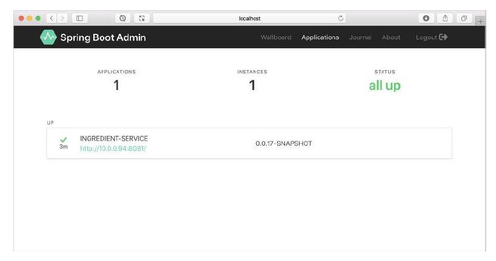
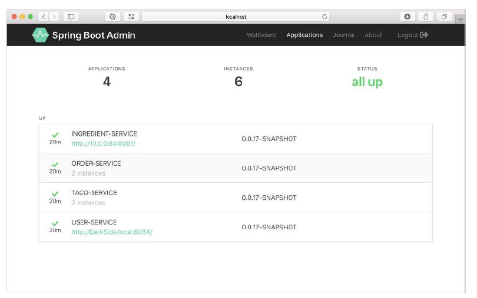
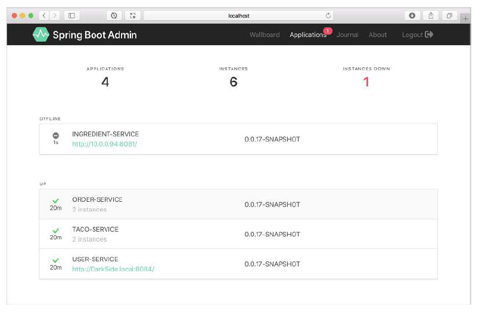

# 17.1.2 注册 Admin 客户端

Admin 服务端，是一个独立于其他 Spring Boot 应用程序的应用程序。要显示来自于其他应用程序的 Actuator 数据，您必须以某种方式使 Admin 服务端感知到其他应用程序。所在要注册 Spring Boot Admin 客户端，有如下两种方式：

* 每个应用程序都向 Admin 服务端显式注册自己。
* 管理服务器通过 Eureka 服务注册中心自动发现客户端。

让我们分别讨论这两种方式。先看如何配置单个应用程序，作为 Spring Boot Admin 客户端，向 Admin 服务端注册。

**显式配置 Admin 客户端应用程序**

为了把 Spring Boot 应用程序注册为 Admin 客户端，您必须在其构建时包含 Spring Boot Admin 客户端 starter。您可以使用 Initializr 轻松添加依赖关系，只需选中 Spring Boot Admin \(Client\) 的复选框。或者您可以为 Maven 构建的 Spring Boot 应用程序添加如下的 `<dependency>` ：

```markup
<dependency>
  <groupId>de.codecentric</groupId>
  <artifactId>spring-boot-admin-starter-client</artifactId>
</dependency>
```

客户端依赖库就绪后，还需要配置 Admin 服务端位置，以便客户端可以自行注册。为此，您需要设置 spring.boot.admin.client.url 属性，将其设置为 Admin 服务端的根 url：

```yaml
spring:
  application:
    name: ingredient-service
  boot:
    admin:
      client:
        url: http://localhost:9090
```

请注意，还设置了 spring.application.name 属性（在本例中，为 ingredient-service）。您已经使用此属性在 Spring Cloud Config 服务和 Eureka 中标识了微服务名。在这里，它有一个类似的目的：为了向 Admin 服务端标识应用程序。一旦重新启动应用程序，您就应该看到它出现在 Admin 服务端中了，如图 17.3 所示。



虽然在图 17.3 中，没有太多关于 ingredient 服务的信息，但仍然显示了应用程序的正常运行时间，以及 Spring Boot Maven 插件配置的构建产物（正如我们在第 16.3.1 节中讨论的），还有构建产物的版本号。请放心，在您单击 Admin 服务端中的应用之后，还有很多其他运行时细节可以查看。我们将在第 17.2 节中，更深入地了解 Admin 服务端的功能。

用于向 Admin 注册 ingredient 服务的配置，需要重复在所有其他应用程序上进行配置。您可能会发现如果只配置 spring.application.name 属性，并让 spring Cloud Config 服务端，向其所有客户端提供 spring.boot.admin.client.url，才是比较方便的做法。或者，更好的是，使用 Eureka 作为注册中心，然后让 Admin 服务端自动发现其他服务。让我们看看如何将 Admin 服务端配置为 Eureka 客户端。

**发现 Admin 客户端**

要启用 Admin 服务端以发现服务，您必须做的，唯一一件事是，将 Spring Cloud Netflix Eureka 客户端 starter， 添加到 Admin 服务端的构建中。下面是您需要的 Maven `<dependency>`：

```markup
<dependency>
  <groupId>org.springframework.cloud</groupId>
  <artifactId>spring-cloud-starter-netflix-eureka-client</artifactId>
</dependency>
```

> 注意：您也可以使用 Spring Initializr，通过勾选 Eureka Discovery 复选框来获得此依赖关系。

如果 Admin 服务端是 Eureka 的客户端，则不需要任何其他配置了。您可以跳过上一节中描述的所有客户端配置。因为 Admin 服务端自动发现在 Eureka 中注册的所有应用程序，并使用其 Actuator 数据为显示做好准备。例如，如果有几个 Taco Cloud 服务在 Eureka 中注册了，它们也将显示在 Admin 服务端中（图 17.4）。



如图 17.4 所示，列出了四个不同的应用程序，以及六个服务：两个 Order 服务实例，两个 Taco 服务实例，一个 User 服务、一个 Ingredient 服务。显示的所有应用程序都是 UP 状态。如果任何服务离线（例如 User 服务），那么可能单独出现在 Admin 服务端中（图 17.5）。



作为 Eureka 客户端，Admin 服务端还将自己注册为 Eureka 的服务。为了防止这种情况发生，可以将 eureka.client.register-with-eureka 属性设置为 false：

```yaml
eureka:
  client:
    register-with-eureka: false
```

与其他 Eureka 客户端一样，如果没有在默认主机和端口上侦听，您需要手工指定 Eureka 服务端的位置。以下 YAML 配置了 Eureka 位置信息，主机位于 eureka1.tacocloud.com：

```yaml
eureka:
  client:
    service-url:
      defaultZone: http://eureka1.tacocloud.com:8761/eureka/
```

现在，您已经向 Admin 服务端注册了一些 Taco Cloud 服务，让我们看看 Admin 服务端都提供了什么。

