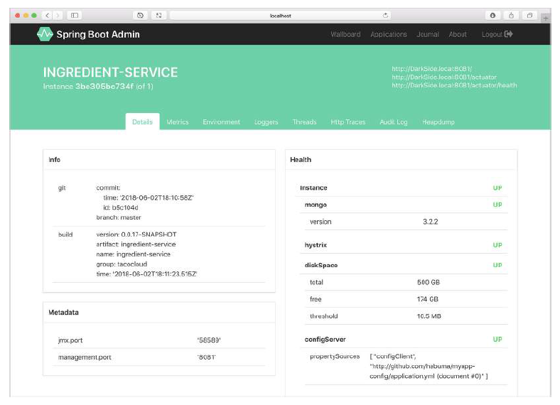

# 17.2.1 查看普通应用程序运行状况和信息

如第 16.2.1 节所述，Actuator 通过 `/health` 和 `/info` 端点，显示应用程序运行状况和一般信息。Admin 服务端在 Details 选项卡下显示该信息，如图 17.6 所示。

如果您滚动查看 Detail 选项卡中的 Health 和 Info 部分，您将发现来自应用程序 JVM 的统计信息，包括图形化显示的内存、线程和处理器使用情况（图 17.7）。

图表中显示的信息，以及 Processes 和 Garbage Collection Pauses 两部分的信息，可以提供有关应用程序如何利用 JVM 资源的相关情况。

