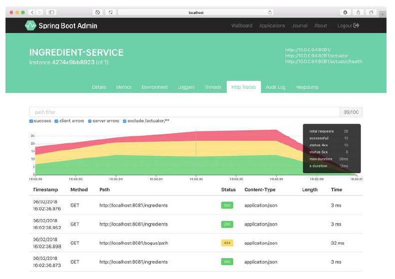
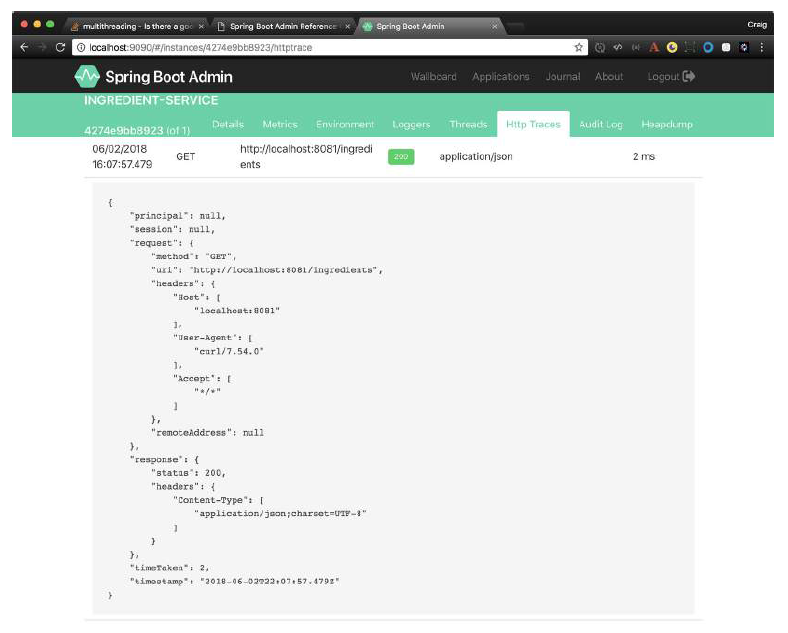

# 17.2.6 追踪 HTTP 请求

Spring Boot Admin UI 的 HTTP Trace 选项卡（图 17.12），显示来自 Actuator 的 `/httptrace` 端点。但与返回 100 个最新 HTTP 跟踪的 `/httptrace` 端点不同，HTTP traces 选项卡列出了完整的 HTTP 跟踪历史记录。只要一直在选项卡上，它就会一直更新。如果你离开选项卡返回，它最初只显示 100 个最近的请求，但从那一时点开始继续持续追踪。

正如您所看到的，HTTP Trace 选项卡在顶部包含一个用于跟踪的堆叠图，HTTP 流量随时间变化。图表使用颜色表示成功与失败。绿色表示成功，黄色表示客户端错误（例如，400 级的 HTTP 响应），红色表示服务器错误（例如，500 级的 HTTP 响应）。如果将鼠标悬停在图形上，将出现悬浮框（如图 17.12 的右上侧），分别给出给定时间点的请求计数。

图表下方是跟踪历史记录，包括应用程序接收到的每个请求。如果单击任何行，该行将展开以显示关于请求的其他信息，包括请求和响应头（图 17.13）。

