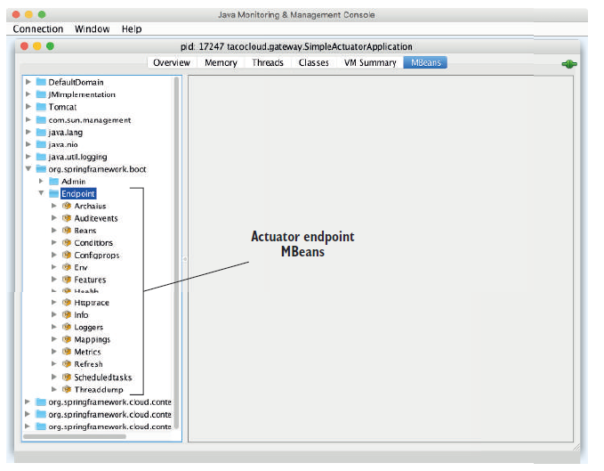
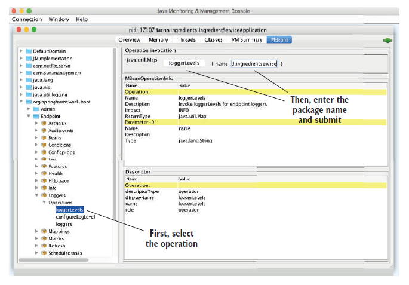
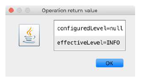

# 18.1 使用 Actuator MBean

回顾一下表 16.1 列出的所有 Actuator 端点，除 `/heapdump` 以外都作为 MBean 公开了。您可以使用任何 JMX 客户端连接这些 Actuator 端点 MBean。如图 18.1 所示，使用 Java JDK 附带的 JConsole 进行连接，您可以在 `org.springframework.boot` 下找到 MBean 列表。



Actuator 端点 MBean 的一个优点是，默认情况下它们都是公开的。没有必要像使用 HTTP 那样显式指定启用其中任何一个。但是，您可以通过设置 `management.endpoints.jmx.exposure.include` 和 `management.endpoints.jmx.exposure.exclude` 来调整范围。例如，将 Actuator端点 MBean 限制为仅公开 `/health`、`/info`、`/bean` 和 `/conditions` 端点，可以设置 `management.endpoints.jmx.exposure.include` 只包括以下内容：

```yaml
management:
  endpoints:
    jmx:
      exposure:
        include: health,info,bean,conditions
```

或者，如果只有少数几个要排除，则可以设置 `management.endpoints.jmx.exposure.exclude`，像下面这样：

```yaml
management:
  endpoints:
    jmx:
      exposure:
        exclude: env,metrics
```

在这里，您可以使用 `management.endpoints.jmx.exposure.exclude` 来排除 `/env` 和 `metrics` 端点。所有其他 Actuator 端点仍将作为 MBean公开。

要在 JConsole 中的一个 MBean 上执行调用操作，展开左侧树中的端点 MBean，然后选择所需的操作。

例如，如果您想检查 tacos.ingredients 包的日志记录级别，展开 Loggers MBean 并单击名loggerLevels，如图 18.2 所示。在右上角的表单中，输入包名称（tacos.Components），然后单击 LoggerLevel 按钮。



单击 LoggerLevel 按钮后，将弹出一个对话框，显示来自 `/loggers` 端点 MBean 的响应。如图 18.3。



尽管 JConsole UI 使用起来有点笨拙，但您应该了解了使用 Mbean 的诀窍，并以基本相同的方式来探索任何 Actuator 端点。

如果您不喜欢 JConsole，那没关系，还有很多其他 JMX 客户端可供选择使用。

