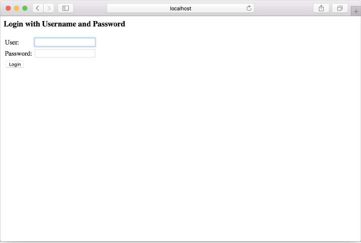

# 4.2 配置 Spring Security

多年来，有几种配置 Spring Security 的方法，包括冗长的基于 xml 的配置。幸运的是，Spring Security 的几个最新版本都支持基于 Java 的配置，这种配置更容易读写。

在本章结束之前，已经在基于 Java 的 Spring Security 配置中配置了所有 Taco Cloud 安全需求。但是在开始之前，可以通过编写下面清单中所示的基本配置类来简化它。程序清单 4.1 一个基本的 Spring Security 配置类

```java
package tacos.security;
​
import org.springframework.context.annotation.Bean;
import org.springframework.context.annotation.Configuration;
import org.springframework.security.config.annotation.web.configuration.EnableWebSecurity;
import org.springframework.security.config.annotation.web.configuration.WebSecurityConfigurerAdapter;
​
@Configuration
@EnableWebSecurity
public class SecurityConfig extends WebSecurityConfigurerAdapter {
}
```

这个基本的安全配置做了什么？嗯，不是很多，但是它确实离需要的安全功能更近了一步。如果再次尝试访问 Taco Cloud 主页，仍然会提示需要登录。但是，将看到一个类似于图 4.2 的登录表单，而不是一个 HTTP 基本身份验证对话框提示。



> 提示：你可能会发现，在手动测试安全性时，将浏览器设置为 private 或 incognito 模式是很有用的。这将确保每次打开私人/隐身窗口时都有一个新的会话。必须每次都登录到应用程序，但是可以放心，你在安全性方面所做的任何更改都将被应用，并且旧 session 的任何残余都不会阻止你查看你的更改。

这是一个小小的改进 —— 使用 web 页面进行登录的提示（即使它在外观上相当简单）总是比 HTTP 基本对话框更友好。将在 4.3.2 节中自定义登录页面。然而，当前的任务是配置一个能够处理多个用户的用户存储。

事实证明，Spring Security 为配置用户存储提供了几个选项，包括：

* 一个内存用户存储
* 基于 JDBC 的用户存储
* 由 LDAP 支持的用户存储
* 定制用户详细信息服务

无论选择哪个用户存储，都可以通过重写 WebSecurityConfigurerAdapter 配置基类中定义的 configure\(\) 方法来配置它。首先，你需要在 SecurityConfig 类中添加以下方法：

```java
@Override
protected void configure(AuthenticationManagerBuilder auth) throws Exception {
    ...
}
```

现在，只需要使用使用给定 AuthenticationManagerBuilder 的代码来替换这些省略号，以指定在身份验证期间如何查找用户。首先，将尝试内存用户存储。

