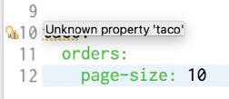
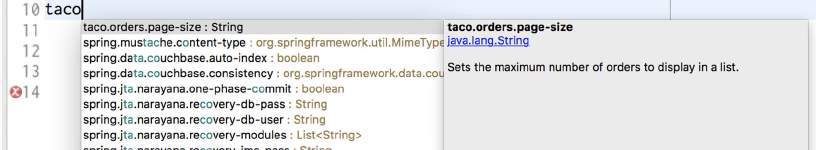

# 5.2.2 声明配置属性元数据

根据 IDE 的情况，你可能已经注意到 application.yml（或是 appication.properties）中的 taco.orders.pageSize 属性有一个警告，说类似未知属性 'taco' 之类的东西。出现此警告是因为缺少关于刚刚创建的配置属性的元数据。图 5.2 显示了我将鼠标悬停在 Spring Tool Suite 中 taco 属性时的效果。



配置属性元数据是完全可选的，并不会阻止配置属性的工作。但是元数据对于提供有关配置属性的最小文档非常有用，特别是在 IDE 中。

例如，当我将鼠标悬停在 security.user.password 属性上时，如图5.3所示，虽然悬停帮助你获得的是最小的，但它足以帮助你了解属性的用途以及如何使用它。


为了帮助那些可能使用你定义的配置属性（甚至可能是你自己定义的）的人，通常最好是围绕这些属性创建一些元数据，至少它消除了 IDE 中那些恼人的黄色警告。

要为自定义配置属性创建元数据，需要在 META-INF（例如，在项目下的 src/main/resources/META-INF 中）中创建一个名为 addition-spring-configuration-metadata.json 的文件。

快速修复缺失的元数据。

如果正在使用 Spring Tool Suite，则有一个用于创建丢失的属性元数据的快速修复选项。将光标放在缺少元数据警告的行上，然后按下 Mac 上的 CMD-1 或 Windows 和 Linux 上的 Ctrl-1 弹出的快速修复（参见图 5.4）。


然后选择 `Create Metadata for…` 选项来为属性添加一些元数据（在 additional-spring-configuration-metadata 中\)。如果该文件不存在，则创建该文件。

对于 taco.orders.pageSize 属性，可以用以下 JSON 设置元数据：

```text
{
    "properties": [
        {
            "name": "taco.orders.page-size",
            "type": "java.lang.String",
            "description":"Sets the maximum number of orders to display in a list."
        }
    ]
}
```

注意，元数据中引用的属性名是 taco.orders.pagesize。Spring Boot 灵活的属性命名允许属性名的变化，比如 taco.orders.page-size 相当于 taco.orders.pageSize。

有了这些元数据，警告就应该消失了。更重要的是，如果你悬停在 taco.orders.pageSize 属性，你将看到如图 5.5 所示的描述。


另外，如图 5.6 所示，可以从 IDE 获得自动完成帮助，就像 Springprovided 的配置属性一样。



配置属性对于调整自动配置的组件和注入到应用程序 bean 中的细节非常有用。但是，如果需要为不同的部署环境配置不同的属性呢？让我们看看如何使用 Spring 配置文件来设置特定于环境的配置。

