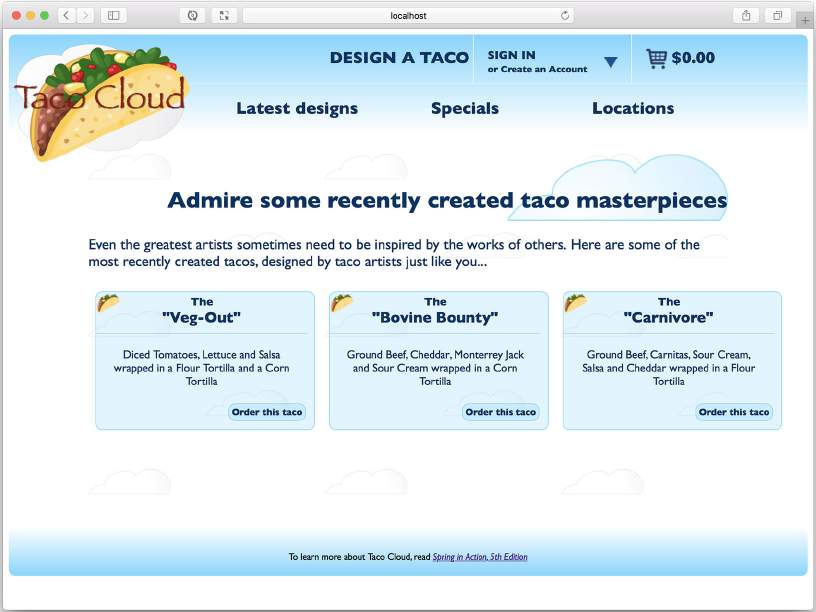

# 6.1.1 从服务器获取数据

Taco Cloud 最酷的事情之一是它允许 Taco 狂热者设计他们自己的 Taco 作品，并与他们的 Taco 爱好者分享。为此，Taco Cloud 需要能够在单击最新设计链接时显示最近创建的 Taco 的列表。

在 Angular 代码中，我定义了一个 RecentTacosComponent，它将显示最近创建的 tacos。RecentTacosComponent 的完整 TypeScript 代码在下面程序清单中。


```javascript
import { Component, OnInit, Injectable } from '@angular/core';
import { Http } from '@angular/http';
import { HttpClient } from '@angular/common/http';
​
@Component({
    selector: 'recent-tacos',
    templateUrl: 'recents.component.html',
    styleUrls: ['./recents.component.css']
})
​
@Injectable()
export class RecentTacosComponent implements OnInit {
    recentTacos: any;
    
    constructor(private httpClient: HttpClient) { }
    
    ngOnInit() {
        this.httpClient.get('http://localhost:8080/design/recent')
            .subscribe(data => this.recentTacos = data);
    }
}
```


请注意 ngOnInit\(\) 方法，在该方法中，RecentTacosComponent 使用注入的 Http 模块执行对 [http://localhost:8080/design/recent](http://localhost:8080/design/recent) 的 Http GET 请求，期望响应将包含 taco 设计的列表，该列表将放在 recentTacos 模型变量中。视图（在 recents.component.HTML 中）将模型数据以 HTML 的形式呈现在浏览器中。在创建了三个 tacos 之后，最终结果可能类似于图 6.2。



这个版面中缺失的部分是一个端点，它处理 `/design/recent` 接口的 GET 请求 ，并使用一个最新设计的 taco 列表进行响应。后面将创建一个新的控制器来处理这样的请求，下面的程序清单显示了怎么去做的。


```java
package tacos.web.api;
​
import java.util.Optional;
import org.springframework.beans.factory.annotation.Autowired;
import org.springframework.data.domain.PageRequest;
import org.springframework.data.domain.Sort;
import org.springframework.hateoas.EntityLinks;
import org.springframework.http.HttpStatus;
import org.springframework.web.bind.annotation.CrossOrigin;
import org.springframework.web.bind.annotation.GetMapping;
import org.springframework.web.bind.annotation.PathVariable;
import org.springframework.web.bind.annotation.RequestMapping;
import org.springframework.web.bind.annotation.ResponseStatus;
import org.springframework.web.bind.annotation.RestController;
​
import tacos.Taco;
import tacos.data.TacoRepository;
​
@RestController
@RequestMapping(path="/design", produces="application/json")
@CrossOrigin(origins="*")
public class DesignTacoController {
    
    private TacoRepository tacoRepo;
    
    @Autowired
    EntityLinks entityLinks;
    
    public DesignTacoController(TacoRepository tacoRepo) {
        this.tacoRepo = tacoRepo;
    }
    
    @GetMapping("/recent")
    public Iterable<Taco> recentTacos() {
        PageRequest page = PageRequest.of(
            0, 12, Sort.by("createdAt").descending());
        return tacoRepo.findAll(page).getContent();
    }
}
```


你可能认为这个控制器的名字听起来很熟悉。在第 2 章中，创建了一个处理类似类型请求的 DesignTacoController。但是这个控制器是用于多页面 Taco Cloud 应用程序的，正如 @RestController 注解所示，这个新的 DesignTacoController 是一个 REST 控制器。

@RestController 注解有两个用途。首先，它是一个像 @Controller 和 @Service 这样的原型注解，它通过组件扫描来标记一个类。但是与 REST 的讨论最相关的是，@RestController 注解告诉 Spring，控制器中的所有处理程序方法都应该将它们的返回值直接写入响应体，而不是在模型中被带到视图中进行呈现。

或者，可以使用 @Controller 来注解 DesignTacoController，就像使用任何 Spring MVC 控制器一样。但是，还需要使用 @ResponseBody 注解所有处理程序方法，以获得相同的结果。另一个选项是返回一个 ResponseEntity 对象，我们稍后将讨论它。

类级别的 @RequestMapping 注解与 recentTacos\(\) 方法上的 @GetMapping 注解一起工作，以指定 recentTacos\(\) 方法负责处理 `/design/recent` 接口的 GET 请求（这正是 Angular 代码所需要的）。

注意，@RequestMapping 注解还设置了一个 produces 属性。这指定了 DesignTacoController 中的任何处理程序方法只在请求的 Accept 头包含 “application/json” 时才处理请求。这不仅限制了 API 只生成 JSON 结果，还允许另一个控制器（可能是第 2 章中的 DesignTacoController）处理具有相同路径的请求，只要这些请求不需要 JSON 输出。尽管这将 API 限制为基于 JSON 的，但是欢迎将 produces 设置为多个内容类型的字符串数组。例如，为了允许 XML 输出，可以向 produces 属性添加 “text/html”：

```java
@RequestMapping(path="/design", produces={"application/json", "text/xml"})
```

在程序清单 6.2 中可能注意到的另一件事是，该类是用 @CrossOrigin 注解了的。由于应用程序的 Angular 部分将运行在独立于 API 的主机或端口上（至少目前是这样），web 浏览器将阻止 Angular 客户端使用 API。这个限制可以通过在服务器响应中包含 CORS（跨源资源共享）头来克服。Spring 使得使用 @CrossOrigin 注解应用 CORS 变得很容易。正如这里所应用的，@CrossOrigin 允许来自任何域的客户端使用 API。

recentTacos\(\) 方法中的逻辑相当简单。它构造了一个 PageRequest 对象，该对象指定只想要包含 12 个结果的第一个（第 0 个）页面，结果按照 taco 的创建日期降序排序。简而言之就是你想要一打最新设计的 tacos。PageRequest 被传递到 TacoRepository 的 findAll\(\) 方法的调用中，结果页面的内容被返回给客户机（如程序清单 6.1 所示，它将作为模型数据显示给用户）。

现在，假设需要提供一个端点，该端点通过其 ID 获取单个 taco。通过在处理程序方法的路径中使用占位符变量并接受 path 变量的方法，可以捕获该 ID 并使用它通过存储库查找 taco 对象：

```java
@GetMapping("/{id}")
public Taco tacoById(@PathVariable("id") Long id) {
    Optional<Taco> optTaco = tacoRepo.findById(id);
    
    if (optTaco.isPresent()) {
        return optTaco.get();
    }
    
    return null;
}
```

因为控制器的基本路径是 `/design`，所以这个控制器方法处理 `/design/{id}` 的 GET 请求，其中路径的 `{id}` 部分是占位符。请求中的实际值指定给 id 参数，该参数通过 @PathVariable 映射到 `{id}`占位符。

在 tacoById\(\) 内部，将 id 参数传递给存储库的 findById\(\) 方法来获取 Taco。findById\(\) 返回一个可选的 &lt;Taco&gt;，因为可能没有具有给定 ID 的 Taco。如果匹配，则在可选的 &lt;Taco&gt; 对象上调用 get\(\) 以返回实际的 Taco。

如果 ID 不匹配任何已知的 taco，则返回 null，然而，这并不理想。通过返回 null，客户端接收到一个空体响应和一个 HTTP 状态码为 200（OK）的响应。客户端会收到一个不能使用的响应，但是状态代码表明一切正常。更好的方法是返回一个带有 HTTP 404（NOT FOUND）状态的响应。

正如它目前所写的，没有简单的方法可以从 tacoById\(\) 返回 404 状态代码。但如果你做一些小的调整，你可以设置适当的状态代码：

```java
@GetMapping("/{id}")
public ResponseEntity<Taco> tacoById(@PathVariable("id") Long id) {
    Optional<Taco> optTaco = tacoRepo.findById(id);
    if (optTaco.isPresent()) {
        return new ResponseEntity<>(optTaco.get(), HttpStatus.OK);
    }
    
    return new ResponseEntity<>(null, HttpStatus.NOT_FOUND);
}
```

现在，tacoById\(\) 不返回 Taco 对象，而是返回一个 ResponseEntity&lt;Taco&gt;。如果发现 taco，则将 taco 对象包装在 HTTP 状态为 OK 的 ResponseEntity 中（这是之前的行为）。但是，如果没有找到 taco，则在 ResponseEntity 中包装一个 null，并加上一个 HTTP status（NOT FOUND），以指示客户端试图获取一个不存在的 taco。

现在已经开始为 Angular 客户端或任何其他类型的客户端创建 Taco Cloud API 了。出于开发测试的目的，可能还希望使用 curl 或 HTTPie（[https://httpie.org/](https://httpie.org/)）等命令行实用程序来了解 API。例如，下面的命令行显示了如何使用 curl 获取最近创建的 taco：

```bash
$ curl localhost:8080/design/recent
```

如果更喜欢 HTTPie，可以用下面这种方式：

```bash
$ http :8080/design/recent
```

但是，定义返回信息的端点只是开始。如果 API 需要从客户端接收数据呢？让我们看看如何编写处理请求输入的控制器方法。

