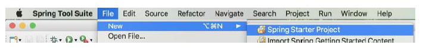
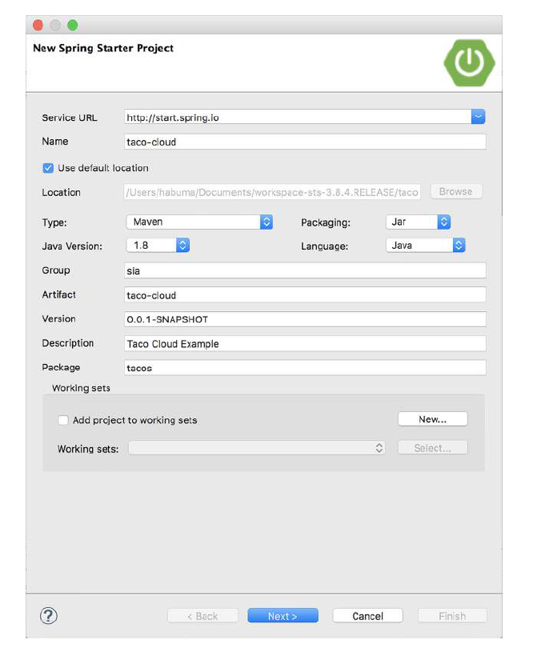
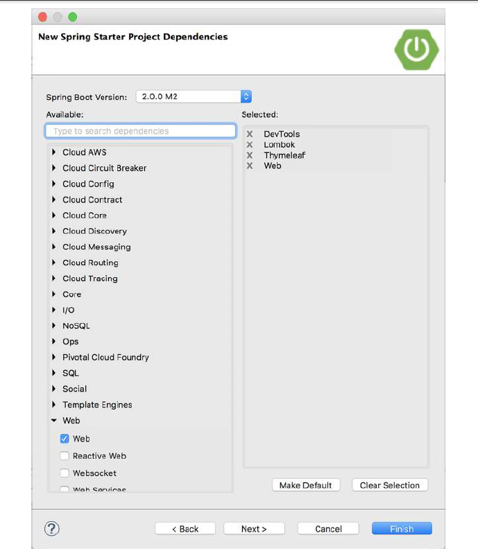
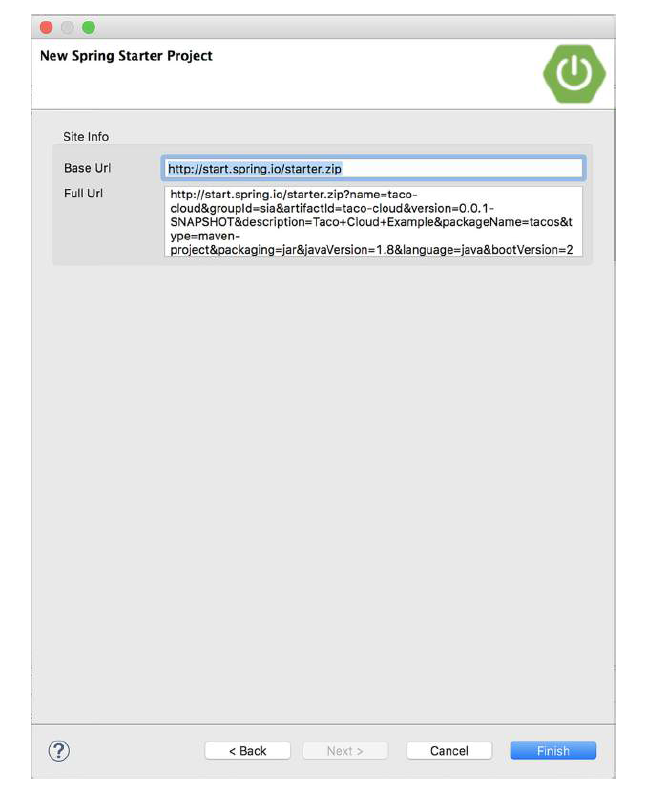

# A.1 使用 Spring 工具套件初始化项目

要使用 Spring 工具套件初始化新的 Spring 项目，请选择 Spring Starter Project 菜单选项，位置在 File > New 菜单中，如图 A.1 所示。

>注意：这是使用 Spring 工具套件进行初始化 Spring 项目的简要说明。更详细的说明，请参见第 1.2.1 节。

您将看到项目创建的第一个对话框（图 A.2）。在该页面中，您将定义基本的项目信息，例如项目名称、坐标（group ID 和 artifact ID）、版本和基本包名称。也可以指定项目是使用 Maven 还 Gradle 构建，是生成 JAR 文件还是 WAR 文件，使用哪个版本的 Java 构建，甚至可以指定要使用的其他 JVM 语言，如 Groovy 或 Kotlin。

此页面上的第一个字段要求您指定 Spring Initializr 报备的位置。如果您正在运行或使用 Initializr 的自定义实例，则需要
在此处指定 Initializr 服务的 URL。否则，您就可以使用默认值：[http://start.spring.io](http://start.spring.io)。

定义基本项目信息后，单击“Next”查看项目依赖项页面（图 A.3）。

在“项目依赖项”页面上，可以指定项目的所有依赖项。其中许多依赖项是 Spring Boot Starter 依赖项，尽管 Spring 项目中通常都会使用一些其他依赖项。

左侧列出了可用的依赖项，这些依赖项分组显示，可展开或折叠。如果您在查找依赖项时遇到困难，您还可以搜索依赖项以缩小选择范围。

要向项目添加依赖项，请选中依赖项名称。您的选择将显示右侧列表中（标题为 Selected）。您可以通过单击所选定的依赖项前面的 "X" ，以删除某个依赖项。或使用 Clear Selection 清除所有选定的依赖项。

还有一个更便捷的使用方式：如果您发现有一组特定的核心依赖项，您总是（或经常）用于项目，可以在选择这些依赖项之后，单击“Make Default”按钮。下一次创建项目时它们就默认选中了。

选择完依赖项以后，单击“Finish”按钮生成项目，并将其添加到工作区。

如果要使用 http://start.spring.io 以外的其他 Initializr，单击 Next 设置 Initializr 的基本 URL，如图 A.4 所示。

Base Url 字段指定 Initializr API 侦听的 Url。这是在此页面上唯一能更改的字段。Full Url 字段显示完整的 Url，这将用于从 Initializr 请求创建新项目。