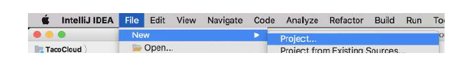
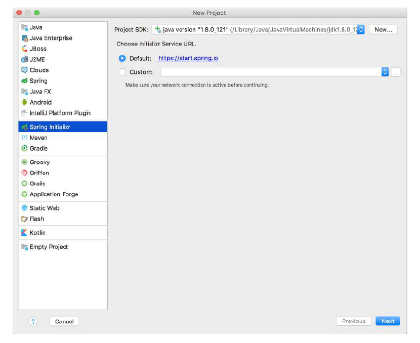
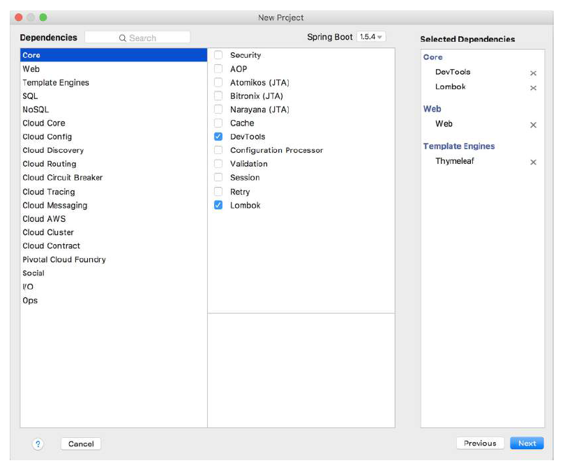
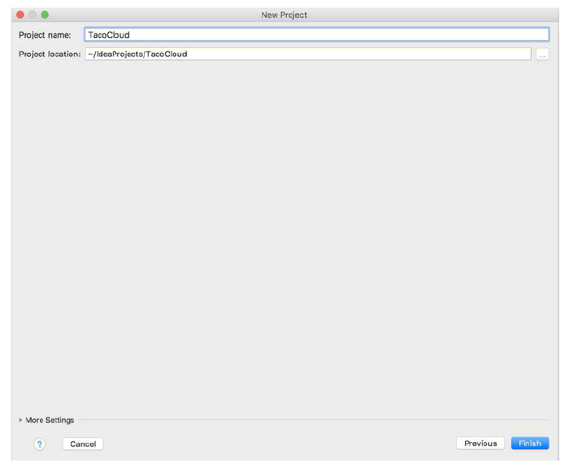

# A.2 使用 IntelliJ IDEA 初始化项目

要在 IntelliJ IDEA 中开始一个新的 Spring 项目，从 File > New 菜单选择 Project 菜单项，如图 A.5 所示。

这将打开新建 Spring Initializr 项目向导的第一个页面（参见图 A.6）。

在此页面上，您通常只需单击“Next”转到向导的下一页面。但是如果您不想使用 https://start.spring.io, 您需要选择 Custom 单选按钮，并输入 Spring Initializr 的 URL。

单击“Next”后，您将看到一个页面，该页面要求输入项目基本信息，如图 A.7 所示。您可能熟悉此页面上的某些字段，因为它们经常出现在 Maven pom.xml 文件中。事实上，如果您选择的项目类型是 Maven，这些字段就会写入 pom.xml 文件中。当然按您的喜好，您可以选择使用 Gradle。

填写完基本项目信息后，单击“Next”以显示项目依赖项页面（图 A.8）。

最左边的列表中，按按分类进行显示。选择类别后，将该类别的选项显示在中间列表中。您选择的依赖项将（根据类别）列在右侧列表中。

选择所有依赖项后，单击“Next”。会跳转到项目向导的最后一个页面，如图 A.9 所示，它要求您提供项目名称，并指定项目在磁盘上的保存位置。

单击“Finish”，您的项目将被创建，并加载到 IntelliJ IDEA 工作区。

