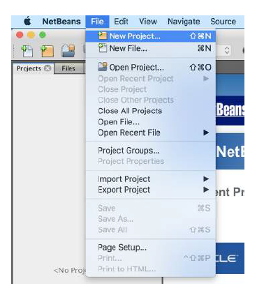
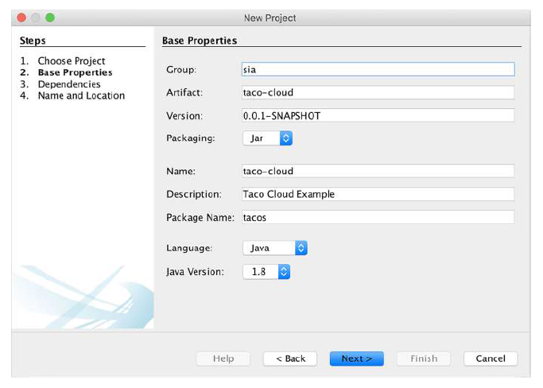
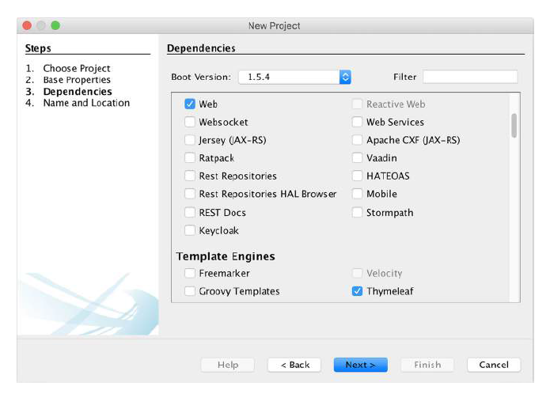
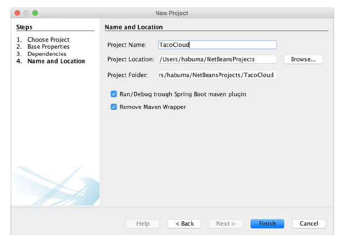

# A.3 使用 NetBeans 初始化项目

要在 NetBeans 中创建一个新的 Spring 项目，首先选择 File 菜单下的 New Project 菜单项，如图 A.10 所示。

您将看到新建项目向导的第一页。如图 A.11 所示，此页面允许您选择要创建的项目类型。

对于 Spring Boot 项目，从左侧的类别列表中选择 Maven，然后从右侧的项目列表中选择 Spring Boot Initializr Project。然后单击“Next”转到下一页面。

新建项目向导的第二页（图 A.12）允许您设置项目基本信息，例如项目名称、版本和其他最终用于 Maven pom.xml 文件中的定义项。

指定项目基本信息后，单击“Next”导航到选择依赖项页面，如图 A.13 所示。

依赖项是按类别组织的复选框，都列在同一列表中。如果无法找到所需的特定依赖项，可以使用顶部 Filter 文本框以限制选项范围。

您还可以在此页面上，指定希望使用哪个版本的 Spring Boot。默认情况下，将设置为当前稳定 Spring Boot 版本。

为项目选择依赖项后，单击“Next”导航到向导的最后一页，如图 A.14 所示。

此页面允许您最后指定一些项目的详细信息，包括项目名称和在文件系统上的存储位置。（Project Folder 字段是只读的）还为您提供了通过 Maven Spring 插件而不是通过 NetBeans 运行和调试项目的选择。您还可以选择让 NetBeans 从生成的项目中删除 Maven 包装器。

设置最后的项目信息后，单击 “Finish” 以生成项目，并将其添加到 NetBeans 工作区。
