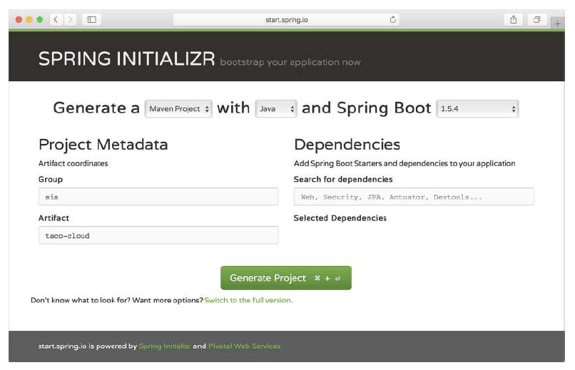
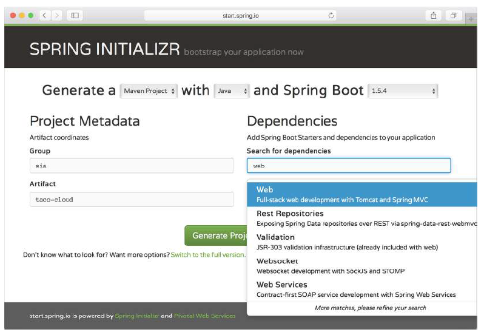
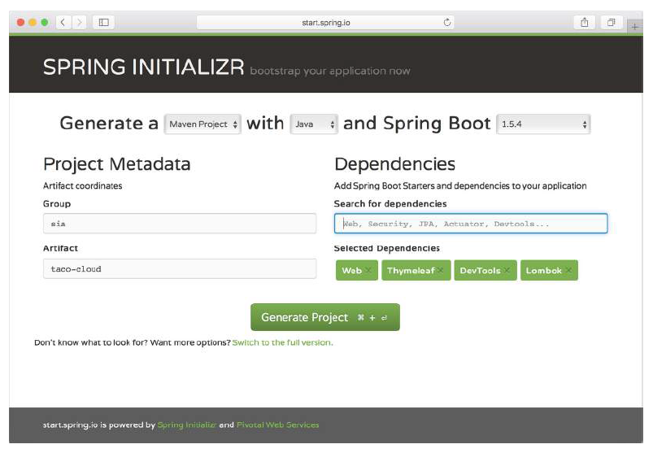
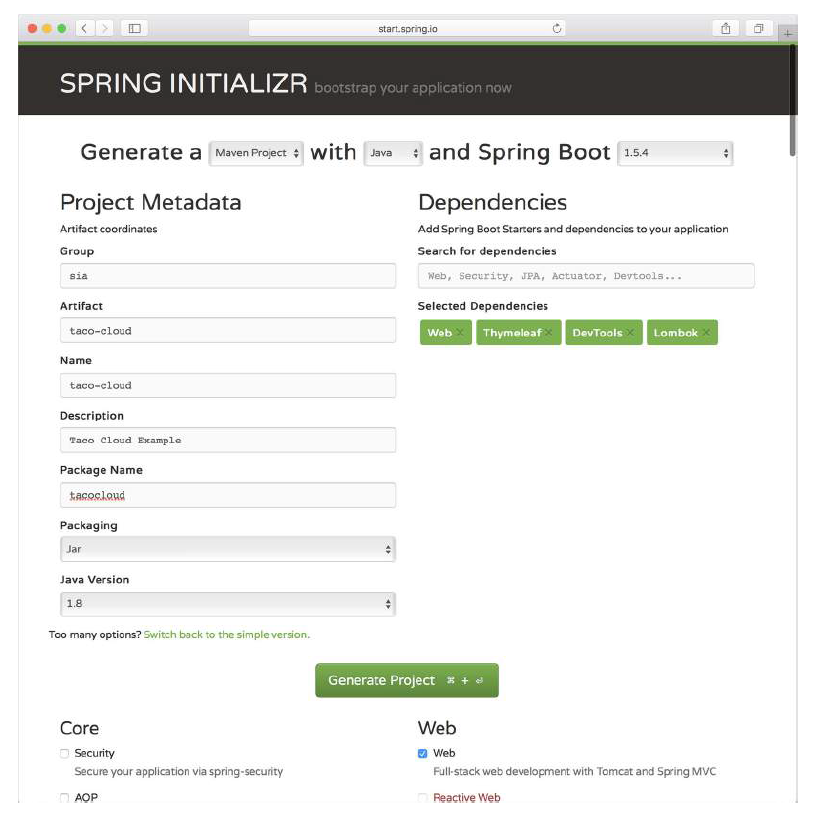

# A.4 在 start.spring.io 初始化项目

尽管到目前为止，我们讨论的基于 IDE 的初始化项目方式，可能适合您的需求，但也可能您会使用其他 IDE，或者喜欢使用更简单的文本编辑器。在这种情况下，您可以使用 Spring Initializr web 界面。

第一步，请用您喜欢的 web 浏览器访问 [https://start.spring.io](https://start.spring.io)。您应该看到一个 Spring Initializr web 用户界面的简单版本，如图 A.15 所示。

在简单版本的 Initializr web 应用界面中，您只需要填写一些非常简单的基本信息，包括是否要使用 Maven 或 Gradle 进行构建、
要使用哪种语言开发项目、要构建哪个版本的 Spring Boot 以及项目的 group 和 artifact。

您还可以使用 Search for Dependencies 输入框，来查找依赖项。例如，图 A.16 中，键入了“web”，搜索包含“web”关键字的依赖项。

当您看到所需的依赖项时，按键盘上的 Return 键将其选中，并将它添加到所选依赖列表中。图 A.17 中 Selected Dependencies 下面的框显示了已选择的依赖项：Web、Thymeleaf、DevTools 和 Lombok。

如果您不需要某个所选的依赖项，可以单击依赖项右侧的“X”删除依赖项。

完成后，可以单击“Generate Project”按钮（或使用按钮上显示的键盘快捷键，此快捷键因操作系统而异），Initializr 将生成项目并将下载 zip 文件。然后就可以解压文件，并将其加载到任何 IDE 或编辑器中。

如果您喜欢做更多的配置，可以单击“Generate Project”按钮下的 Switch to the Full Version 链接。这将展示更多的字段和所有可用依赖项。图 A.18 显示了 web 界面的完整版本。

完整版本中的大多数字段值，都来自简单版本输入的 Group 和 Artifact 值。完整的版本可以让您重新配置些值。

图 A.18 仅显示了一组依赖项复选框。实际上这些复选框很多，因此您需要来回滚动以查找您要的依赖项。幸运的是，搜索框在完整版中仍然可以使用。
